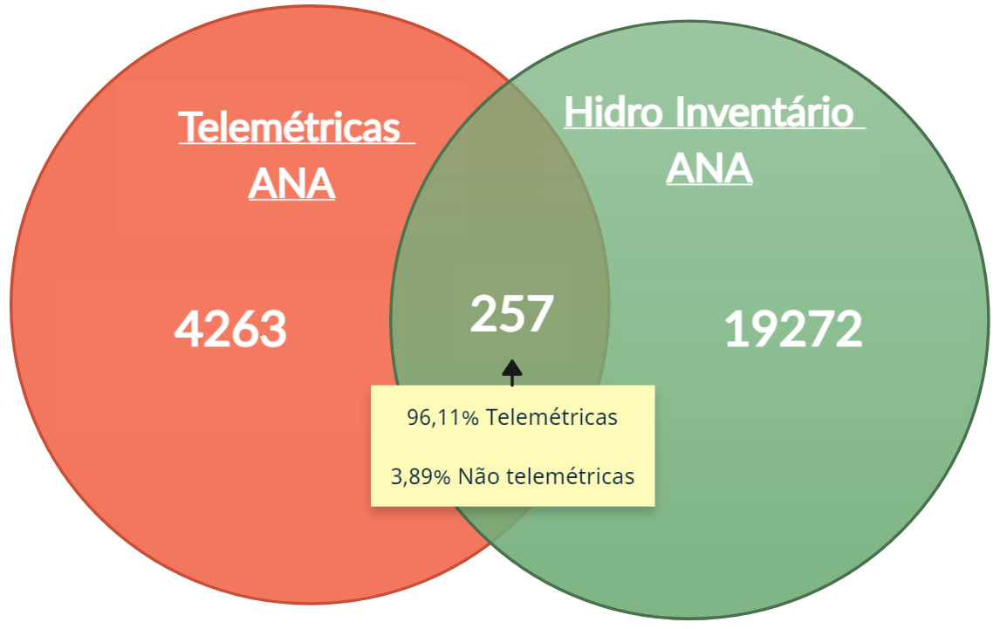

ANA preciptation dataset
===========
Updated: 2024-08-14

ANA gauges stations
--------------------------------

Description
^^^^^^^^^^^

This documentation was created to describe the process of acquiring daily accumulated rainfall data recorded by rain gauges registered with the National Water Agency (ANA) in Brazil. The information was downloaded from the `ANA Telemetry portal <https://telemetriaws1.ana.gov.br/ServiceANA.asmx>`_ . However, in order to be able to download the data of interest, it was necessary to develop algorithms combining the Web scraping computational technique to read and extract the information obtained, by station, via HTTP GET requests.

However, in order to start the download process, it is necessary to have the code of the station of interest, so prior to downloading the rainfall data, a survey was carried out of all the stations with rain gauges registered on the ANA system.

List of stations registered by the ANA
^^^^^^^^^^^^^^^^^^^^^^^^^^

ANA has two types of stations with rain gauges registered in its system. The telemetric (automatic) stations are responsible for collecting and assisting in monitoring hydrometeorological measurements remotely, with real-time data or indicators. The so-called conventional stations have rain gauges that require conventional collection of hydrometeorological data, i.e., daily records made by observers and measurements taken in the field by hydrology technicians and hydrologist engineers. ANA's telemetry portal provides information about these two types of stations through the electronic addresses https://telemetriaws1.ana.gov.br/ServiceANA.asmx?op=HidroInventario and https://telemetriaws1.ana.gov.br/EstacoesTelemetricas.aspx, used to access descriptions of conventional and telemetric stations, respectively.

The list of telemetric stations is made available by ANA in spreadsheet format (.xls) and contains information such as: Station Name (``NomeEstacao``), Station Code (``CodEstacao``), Codes associated with the river basins and sub-basins to which the station is related (``Bacia``, ``SubBacia``), names for the station operator and person in charge, as well as geolocation information such as latitude, longitude, and altitude. This list is available in the file ``EstacoesTelemetricas_Todas_12_08_2024.xls``, and is structured according to the following table.

+------+----------------------------------+------------+---------------------------------------------------+----------+-----------+----------+------------------+---------------+
|      | NomeEstacao                      | CodEstacao | Responsavel                                       | Latitude | Longitude | Altitude | Origem           | StatusEstacao |
+------+----------------------------------+------------+---------------------------------------------------+----------+-----------+----------+------------------+---------------+
| 0    | RIO PRETO DA EVA                 | 259004     | 00001 - ANA - Agência Nacional de Águas           | -2.7003  | -59.6997  | 0.0      | Açudes Semiárido | Ativo         |
+------+----------------------------------+------------+---------------------------------------------------+----------+-----------+----------+------------------+---------------+
| 1    | UHE BELO MONTE BR230             | 351004     | 00594 - NORTE ENERGIA - Norte Energia S.A         | -3.1267  | -51.7906  | 33.0     | Setor Elétrico   | Ativo         |
+------+----------------------------------+------------+---------------------------------------------------+----------+-----------+----------+------------------+---------------+
| 2    | UHE BELO MONTE SÍTIO PIMENTAL    | 351005     | 00594 - NORTE ENERGIA - Norte Energia S.A         | -3.3758  | -51.9403  | 110.0    | Setor Elétrico   | Ativo         |
+------+----------------------------------+------------+---------------------------------------------------+----------+-----------+----------+------------------+---------------+
| 3    | UHE BELO MONTE VISTA ALEGRE      | 352009     | 00594 - NORTE ENERGIA - Norte Energia S.A         | -3.1186  | -52.2525  | 125.0    | Setor Elétrico   | Ativo         |
+------+----------------------------------+------------+---------------------------------------------------+----------+-----------+----------+------------------+---------------+
| 4    | UHE BELO MONTE SÃO FRANCISCO     | 352010     | 00594 - NORTE ENERGIA - Norte Energia S.A         | -3.2533  | -52.3489  | 124.0    | Setor Elétrico   | Ativo         |
+------+----------------------------------+------------+---------------------------------------------------+----------+-----------+----------+------------------+---------------+
| ...  | ...                              | ...        | ...                                               | ...      | ...       | ...      | ...              | ...           |
+------+----------------------------------+------------+---------------------------------------------------+----------+-----------+----------+------------------+---------------+
| 4713 | PEDRO OSÓRIO                     | 88641000   | 00001 - ANA - Agência Nacional de Águas           | -31.8633 | -52.8161  | 16.0     | CotaOnline       | Ativo         |
+------+----------------------------------+------------+---------------------------------------------------+----------+-----------+----------+------------------+---------------+
| 4714 | ECLUSA SÃO GONÇALO               | 88690050   | 00266 - SEMA-RS - SEMA-RS                         | -31.8111 | -52.3892  | 0.0      | RHN              | Ativo         |
+------+----------------------------------+------------+---------------------------------------------------+----------+-----------+----------+------------------+---------------+
| 4715 | SANTA ISABEL CGH (UFPEL)         | 88700010   | 00266 - SEMA-RS - SEMA-RS                         | -32.1189 | -52.5936  | 0.0      | RHN              | Ativo         |
+------+----------------------------------+------------+---------------------------------------------------+----------+-----------+----------+------------------+---------------+
| 4716 | PORTO DE PELOTAS                 | 88810100   | 00765 - PELOTAS - Prefeitura Municipal de Pelo... | -31.7822 | -52.3333  | 0.0      | RHN              | Ativo         |
+------+----------------------------------+------------+---------------------------------------------------+----------+-----------+----------+------------------+---------------+
| 4717 | ESTACAO TESTE RESOLUCAO 99999999 | 99999999   | 05001 - EMP.TESTES - Empresa de Teste da Resol... | -26.3936 | -51.3936  | 670.0    | Setor Elétrico   | Ativo         |
+------+----------------------------------+------------+---------------------------------------------------+----------+-----------+----------+------------------+---------------+

For the conventional stations, available via `HidroInventario <https://telemetriaws1.ana.gov.br/ServiceANA.asmx?op=HidroInventario>`_, it is necessary to extract the descriptive information via HTTP GET requests, as this type of station does not have a spreadsheet list available from the ANA. As the codes for these stations are not available a priori, the requests were made by Brazilian state, with each query returning all the conventional stations registered in a given federative unit. To carry out this task, a Web Scraping algorithm was developed in the R language, called ``funcao_get_list_ANA_Hidro.R``.

This algorithm is responsible for making requests by state to list the stations available in HidroInventario via the https://telemetriaws1.ana.gov.br/ServiceANA.asmx?op=HidroInventario link and merging the stations from all the states into a spreadsheet containing information such as the station code, latitude, longitude, altitude, municipality and state. This information was saved in a spreadsheet in CSV format called ``HidroInventario_stations_ANA.csv``, with a structure like the one below.

+-------+--------------------------------------+---------+------------------+----------+-----------+----------+-------------+-------------+----------------+------------------------+
|       | Nome                                 | Codigo  | ResponsavelSigla | Latitude | Longitude | Altitude | TipoEstacao | BaciaCodigo | SubBaciaCodigo | TipoEstacaoTelemetrica |
+-------+--------------------------------------+---------+------------------+----------+-----------+----------+-------------+-------------+----------------+------------------------+
| 0     | FAZENDA PARANACRE                    | 771001  | ANA              | -7.9511  | -71.4822  | NaN      | 2           | 1           | 12             | 0                      |
+-------+--------------------------------------+---------+------------------+----------+-----------+----------+-------------+-------------+----------------+------------------------+
| 1     | CRUZEIRO DO SUL                      | 772000  | INMET            | -7.6111  | -72.6811  | 170.0    | 2           | 1           | 12             | 1                      |
+-------+--------------------------------------+---------+------------------+----------+-----------+----------+-------------+-------------+----------------+------------------------+
| 2     | COLOCAÇÃO SÃO FRANCISCO              | 772001  | ANA              | -8.0178  | -72.0347  | NaN      | 2           | 1           | 12             | 0                      |
+-------+--------------------------------------+---------+------------------+----------+-----------+----------+-------------+-------------+----------------+------------------------+
| 3     | SERINGAL BOM FUTURO                  | 772003  | ANA              | -7.8503  | -72.0192  | NaN      | 2           | 1           | 12             | 0                      |
+-------+--------------------------------------+---------+------------------+----------+-----------+----------+-------------+-------------+----------------+------------------------+
| 4     | CRUZEIRO DO SUL                      | 772004  | ANA              | -7.6472  | -72.6769  | 170.0    | 2           | 1           | 12             | 1                      |
+-------+--------------------------------------+---------+------------------+----------+-----------+----------+-------------+-------------+----------------+------------------------+
| ...   | ...                                  | ...     | ...              | ...      | ...       | ...      | ...         | ...         | ...            | ...                    |
+-------+--------------------------------------+---------+------------------+----------+-----------+----------+-------------+-------------+----------------+------------------------+
| 19825 | PCH ENGENHO NOVO SÃO FÉLIX           | 1348002 | IGUAÇU           | -13.5331 | -48.1381  | 318.0    | 2           | 2           | 21             | 0                      |
+-------+--------------------------------------+---------+------------------+----------+-----------+----------+-------------+-------------+----------------+------------------------+
| 19826 | UHE SÃO SALVADOR RIBEIRÃO MUCAMBINHO | 1348010 | ENGIE            | -13.0328 | -48.2453  | 327.0    | 2           | 2           | 21             | 1                      |
+-------+--------------------------------------+---------+------------------+----------+-----------+----------+-------------+-------------+----------------+------------------------+
| 19827 | UHE SÃO SALVADOR RIO CUSTÓDIO        | 1348011 | ENGIE            | -13.0847 | -48.0983  | 300.0    | 2           | 2           | 21             | 1                      |
+-------+--------------------------------------+---------+------------------+----------+-----------+----------+-------------+-------------+----------------+------------------------+
| 19828 | UHE SÃO SALVADOR RIO MUCAMBÃO        | 1348012 | ENGIE            | -13.1706 | -48.2200  | 325.0    | 2           | 2           | 21             | 1                      |
+-------+--------------------------------------+---------+------------------+----------+-----------+----------+-------------+-------------+----------------+------------------------+
| 19829 | BERNARDO SAYÃO                       | 1748009 | SEMARH-TO        | -7.8758  | -48.8775  | NaN      | 2           | 2           | 27             | 1                      |
+-------+--------------------------------------+---------+------------------+----------+-----------+----------+-------------+-------------+----------------+------------------------+

Removing duplicates
^^^^^^^^^^^^^^^^^^^^^^^

After obtaining the codes of all the stations (conventional or telemetric) registered on the ANA system, a check was made for multiple records per station, which could occur due to registration problems. After removing duplicates, according to station code, 4520 unique records remained in the list of telemetry stations. The same check was carried out for the list of conventional stations, resulting in 19529 unique stations. The investigation of duplicate records is presented in detail in the script ``Lista_estacoes_ANA_prec.ipynb`` available in the Github repository.

Multiple record checks per station
^^^^^^^^^^^^^^^^^^^^^^^

The ANA's list of conventional stations contains 19529 stations, while the telemetric stations via the ANA contain just 4545 unique stations. Based on the list of these stations, a study was made of which stations could be present in both lists, so that multiple rainfall series for the same station would not be downloaded.

An investigation revealed 4263 telemetric stations present only in the Telemetric Stations list, 257 stations registered as telemetric and also conventional (HidroInventario) according to both ANA station lists, and finally, 19272 stations are registered only as conventional (HidroInventario).

At the end of this process, information on 23792 stations was organized using the Telemetric and Conventional station lists as sources, as well as the stations that are present in both lists. This structure is shown in the table below.

+-------+------------------------------------+------------+----------+-----------+----------+-----+-------------+----------------+-------------------+------------------+-----------------+----------------+-----------------+
|       | NomeEstacao                        | CodEstacao | Latitude | Longitude | Altitude | UF  | BaciaCodigo | SubBaciaCodigo | ResponsavelCodigo | ResponsavelSigla | OperadoraCodigo | OperadoraSigla | Fonte           |
+-------+------------------------------------+------------+----------+-----------+----------+-----+-------------+----------------+-------------------+------------------+-----------------+----------------+-----------------+
| 0     | COLOCAÇÃO CAJUEIRO                 | 1067000    | -10.3000 | -67.1167  | NaN      | AC  | 1           | 15             | 1                 | ANA              | 1               | ANA            | HidroInventario |
+-------+------------------------------------+------------+----------+-----------+----------+-----+-------------+----------------+-------------------+------------------+-----------------+----------------+-----------------+
| 1     | CRUZEIRO DO SUL                    | 772000     | -7.6111  | -72.6811  | 170.0    | AC  | 1           | 12             | 5                 | INMET            | 5               | INMET          | HidroInventario |
+-------+------------------------------------+------------+----------+-----------+----------+-----+-------------+----------------+-------------------+------------------+-----------------+----------------+-----------------+
| 2     | COLOCAÇÃO SÃO FRANCISCO            | 772001     | -8.0178  | -72.0347  | NaN      | AC  | 1           | 12             | 1                 | ANA              | 1               | ANA            | HidroInventario |
+-------+------------------------------------+------------+----------+-----------+----------+-----+-------------+----------------+-------------------+------------------+-----------------+----------------+-----------------+
| 3     | SERINGAL BOM FUTURO                | 772003     | -7.8503  | -72.0192  | NaN      | AC  | 1           | 12             | 1                 | ANA              | 500             | ÁGUA E SOLO    | HidroInventario |
+-------+------------------------------------+------------+----------+-----------+----------+-----+-------------+----------------+-------------------+------------------+-----------------+----------------+-----------------+
| 4     | CRUZEIRO DO SUL                    | 772004     | -7.6472  | -72.6769  | 170.0    | AC  | 1           | 12             | 1                 | ANA              | 500             | ÁGUA E SOLO    | HidroInventario |
+-------+------------------------------------+------------+----------+-----------+----------+-----+-------------+----------------+-------------------+------------------+-----------------+----------------+-----------------+
| ...   | ...                                | ...        | ...      | ...       | ...      | ... | ...         | ...            | ...               | ...              | ...             | ...            | ...             |
+-------+------------------------------------+------------+----------+-----------+----------+-----+-------------+----------------+-------------------+------------------+-----------------+----------------+-----------------+
| 23787 | RIO CRIXÁS                         | 22170000   | -11.1306 | -48.8003  | 0.0      | TO  | 2           | 22             | 390               | SEMADES-TO       | 390             | SEMADES-TO     | Telemetrica     |
+-------+------------------------------------+------------+----------+-----------+----------+-----+-------------+----------------+-------------------+------------------+-----------------+----------------+-----------------+
| 23788 | GURUPI                             | 22160000   | -11.8517 | -48.8458  | 234.0    | TO  | 2           | 22             | 258               | SEMARH-TO        | 258             | SEMARH-TO      | Telemetrica     |
+-------+------------------------------------+------------+----------+-----------+----------+-----+-------------+----------------+-------------------+------------------+-----------------+----------------+-----------------+
| 23789 | UHE LUÍS EDUARDO MAGALHÃES JACINTO | 22151000   | -11.9817 | -48.6569  | 222.0    | TO  | 2           | 22             | 807               | CONS.LUISMAGA    | 807             | CONS.LUISMAGA  | Telemetrica     |
+-------+------------------------------------+------------+----------+-----------+----------+-----+-------------+----------------+-------------------+------------------+-----------------+----------------+-----------------+
| 23790 | PORTO JERÔNIMO - FAZ. PIRACICABA   | 22220000   | -11.7586 | -47.8367  | 282.0    | TO  | 2           | 22             | 1                 | ANA              | 82              | CPRM           | Telemetrica     |
+-------+------------------------------------+------------+----------+-----------+----------+-----+-------------+----------------+-------------------+------------------+-----------------+----------------+-----------------+
| 23791 | AURORA DO TOCANTINS                | 21758000   | -12.6464 | -46.6572  | 370.0    | TO  | 2           | 21             | 258               | SEMARH-TO        | 258             | SEMARH-TO      | Telemetrica     |
+-------+------------------------------------+------------+----------+-----------+----------+-----+-------------+----------------+-------------------+------------------+-----------------+----------------+-----------------+

This new data table is available in the directory via the file ``listagem_estacoes_prec_ANA_BR.csv`` file and displays data such as Station Name (``NomeEstacao``), Station Code (``CodEstacao``), geolocation information (``Latitude``, ``Longitude``, ``Altitude``, ``UF``), data on the river basin related to the station (``BaciaCodigo``, ``SubBaciaCodigo``), information on the operators and responsible persons (``ResponsavelCodigo``, ``ResponsavelSigla``, ``OperadoraCodigo``, ``OperadoraSigla``) and also the data source (``Fonte``) which informs which listing the station was registered in in the ANA system.

More details about the analysis that resulted in the list of 23792 stations where data was collected via the ANA's `Telemetry portal <https://telemetriaws1.ana.gov.br/ServiceANA.asmx>`_ are presented in the file ``Lista_estacoes_ANA_prec.ipynb`` available in the Github repository.

Data access information
^^^^^^^^^^^^^^^^^^^^^^^

Daily precipitation data for stations registered with the ANA can also be obtained through a manual download process via the open access `HidroWeb <https://www.snirh.gov.br/hidroweb/serieshistoricas>`_ system. From HidroWeb it is possible to access station information by code, name, type, operator, federative unit or associated river basin. However, the download is done individually per station, and a file (.zip) containing the precipitation data in the requested format (.txt, .csv or .mdb) is downloaded.

The HidroWeb system also informs about the possibility of API access. However, users who wish to access HidroWeb data and information in an automated way, using API, must send an email with a request for the data, which will be submitted for evaluation.

- Download precipitation data: https://www.snirh.gov.br/hidroweb/serieshistoricas
- Request API access: https://www.snirh.gov.br/hidroweb/acesso-api

ANA gauges dataset
--------------------------------

Description
^^^^^^^^^^^^^^^^^^^^^^^^^

Data access information
^^^^^^^^^^^^^^^^^^^^^^^^^

Methods of data collection
^^^^^^^^^^^^^^^^^^^^^^^^^

Data-specific information
^^^^^^^^^^^^^^^^^^^^^^^^^

Atualizar a partir daqui...

Variable list for PHC database
^^^^^^^^^^^^^^^^^^^^^^^^^^^^^^
+---------------+-------------------+----------------------------------------------------+----------+-----------------------------------------------------------------------------------------+
| DB Source     | Variable          | Label                                              | Type     | Description                                                                             |
+===============+===================+====================================================+==========+=========================================================================================+
| IBGE          | municipio         | City name                                          | string   | Brazilian city name                                                                    |
+---------------+-------------------+----------------------------------------------------+----------+-----------------------------------------------------------------------------------------+
| IBGE          | co_ibge           | City code                                          | numeric  | Brazilian city code                                                                    |
+---------------+-------------------+----------------------------------------------------+----------+-----------------------------------------------------------------------------------------+
| SISAB         | ano               | Year                                               | numeric  | Year                                                                                    |
+---------------+-------------------+----------------------------------------------------+----------+-----------------------------------------------------------------------------------------+
| SISAB         | epiweek           | Epiweek                                            | numeric  | Epiweek                                                                                 |
+---------------+-------------------+----------------------------------------------------+----------+-----------------------------------------------------------------------------------------+
| SISAB         | atend_totais      | Total PHC Encouters                                | numeric  | Total PHC Encounters in Brazilian cities                                                |
+---------------+-------------------+----------------------------------------------------+----------+-----------------------------------------------------------------------------------------+
| SISAB         | atend_ivas        | Upper Respiratory Infections related symptoms encounters | numeric  | Upper Respiratory Infections related symptoms encounters in Brazilian cities            |
+---------------+-------------------+----------------------------------------------------+----------+-----------------------------------------------------------------------------------------+
| SISAB         | atend_arbov       | Arbovirus Infection related symptoms encounters    | numeric  | Arbovirus Infection related symptoms in Brazilian cities                                |
+---------------+-------------------+----------------------------------------------------+----------+-----------------------------------------------------------------------------------------+
| SISAB         | faixa_etaria      | Age range                                          | string   | Age range from individuals that were attended in PHC                                    |
+---------------+-------------------+----------------------------------------------------+----------+-----------------------------------------------------------------------------------------+
| e-Gestor APS  | pc_cobertura_sf   | Estimated coverage of family health teams          | numeric  | Estimated coverage of family health teams                                                |
+---------------+-------------------+----------------------------------------------------+----------+-----------------------------------------------------------------------------------------+
| e-Gestor APS  | pc_cobertura_ab   | Estimated coverage of all PHC Teams                | numeric  | Estimated coverage of all PHC Teams                                                     |
+---------------+-------------------+----------------------------------------------------+----------+-----------------------------------------------------------------------------------------+
| IBGE          | cod_rgiimediata   | Immediate Region code                              | numeric  | Groupings of municipalities that have as their main reference the urban network and have a local urban center as a basis |
+---------------+-------------------+----------------------------------------------------+----------+-----------------------------------------------------------------------------------------+
| IBGE          | nome_rgi          | Immediate Region name                              | string   | Groupings of municipalities that have as their main reference the urban network and have a local urban center as a basis |
+---------------+-------------------+----------------------------------------------------+----------+-----------------------------------------------------------------------------------------+
| IBGE          | cod_rgint         | Intermediate Geographical Regions codes            | numeric  | Organize the Immediate Regions in the territory based on a region that provides more complex services, such as specialized medical services or large universities |
+---------------+-------------------+----------------------------------------------------+----------+-----------------------------------------------------------------------------------------+
| IBGE          | nome_rgint        | Intermediate Geographical Regions names            | string   | Organize the Immediate Regions in the territory based on a region that provides more complex services, such as specialized medical services or large universities |
+---------------+-------------------+----------------------------------------------------+----------+-----------------------------------------------------------------------------------------+

Data Quality Index (DQI)
^^^^^^^^^^^^^^^^^^^^^^^^

Limitations of ANA gauges dataset
^^^^^^^^^^^^^^^^^^^^^^^^^^

.. rubric:: References

(1) Bagaria J, Jansen T, Marques DFP, Hooiveld M, McMenamin J, de Lusignan S, Vilcu AM, Meijer A, Rodrigues AP, Brytting M, Mazagatos C, Cogdale J, van der Werf S, Dijkstra F, Guiomar R, Enkirch T, Valenciano M, I-MOVE-COVID-19 study team. Rapidly adapting primary care sentinel surveillance across seven countries in Europe for COVID-19 in the first half of 2020: strengths, challenges, and lessons learned. Euro Surveill. 2022;27(26):pii=2100864. doi:10.2807/1560-7917.ES.2022.27.26.2100864.

(2) Prado NMBL, Biscarde DGDS, Pinto Junior EP, Santos HLPCD, Mota SEC, Menezes ELC, Oliveira JS, Santos AMD. Primary care-based health surveillance actions in response to the COVID-19 pandemic: contributions to the debate. Cien Saude Colet. 2021l;26(7):2843-2857. doi: 10.1590/1413-81232021267.00582021.

(3) Cerqueira-Silva T, Oliveira JF, Oliveira VA, Florentino PTV, Sironi A, Penna GO, Ramos PIP, Boaventura VS, Barral-Netto M, Marcilio I. Early warning system using primary healthcare data in the post-COVID-19-pandemic era: Brazil nationwide case-study. Pre-print available at medRxiv: doi: 10.1101/2023.11.24.23299005

(4) Sellera PEG, Pedebos LA, Harzheim E, Medeiros OL de, Ramos LG, Martins C, D’Avila OP. Monitoramento e avaliação dos atributos da Atenção Primária à Saúde em nível nacional: novos desafios. Ciênc Saúde Coletiva. 2020;25(4):1401–12. doi:10.1590/1413-81232020254.36942019

**Contributors**

+-------------------+----------------------------------------------------------------------+
| Marcos Eustorgio Filho | Center for Data and Knowledge Integration for Health (CIDACS),  |
|                        | Instituto Gonçalo Moniz, Fundação Oswaldo Cruz, Salvador, Brazil|
+-------------------+----------------------------------------------------------------------+
| Danielson Neves        | Center for Data and Knowledge Integration for Health (CIDACS),  |
|                        | Instituto Gonçalo Moniz, Fundação Oswaldo Cruz, Salvador, Brazil|
+-------------------+----------------------------------------------------------------------+

