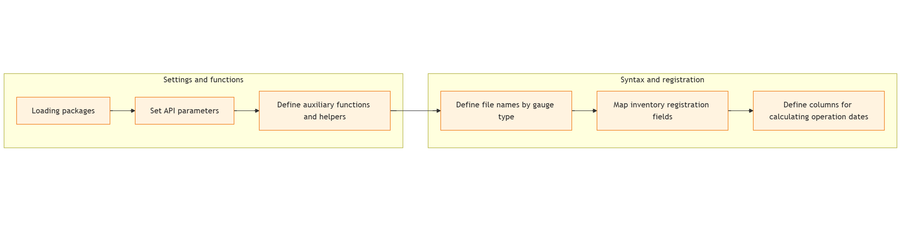
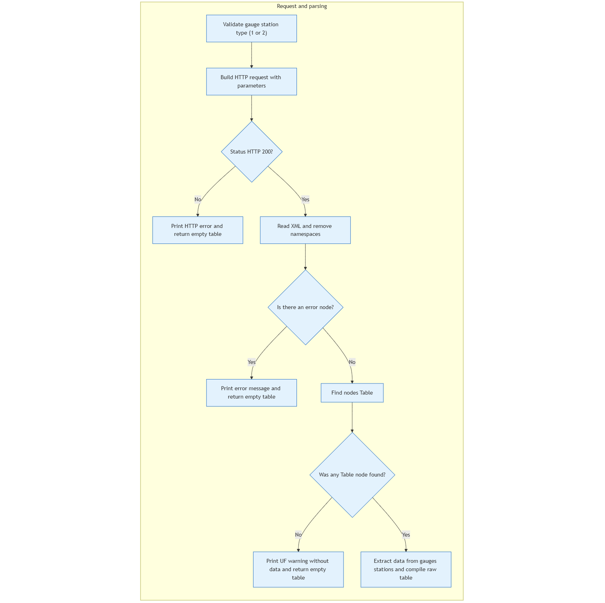
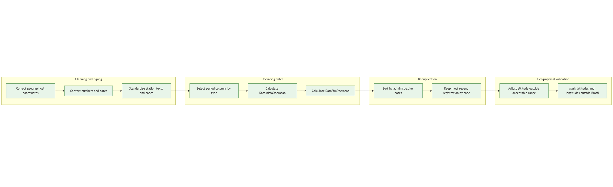
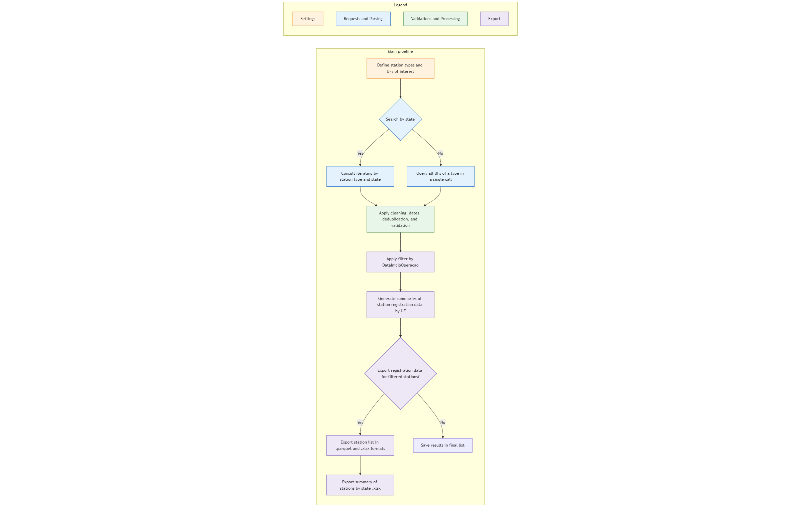

###########################################
ANA datasets
###########################################

Updated: 2025-12-10

.. contents::
   :local:
   :depth: 3

*******************
ANA gauges stations
*******************

Introdução
==========
Esta documentação descreve tecnicamente como são obtidos, processados e estruturados os dados cadastrais das estações hidrológicas disponibilizadas pela Agência Nacional de Águas e Saneamento Básico (ANA). As informações são acessadas diretamente pela API pública do sistema ServiceANA, disponível em `ServiceANA <https://telemetriaws1.ana.gov.br/ServiceANA.asmx>`_ , por meio da seção `HidroInventário <https://telemetriaws1.ana.gov.br/ServiceANA.asmx?op=HidroInventario>`_ . O algoritmo desenvolvido envia solicitações HTTP GET, interpreta o retorno em XML, padroniza campos, corrige inconsistências e organiza os dados em arquivos estruturados, garantindo repetibilidade e qualidade no tratamento tanto de estações fluviométricas (nível/descarga) quanto pluviométricas (chuva).
Para realizar o download das informações detalhadas de cada estação, foi necessário primeiro identificar todas as estações registradas no sistema, uma vez que o código individual de cada uma é obrigatório nas requisições. Assim, antes de coletar os dados específicos dos dois tipos de estação considerados, o script executa uma varredura inicial do inventário completo por meio de requisições automatizadas, aplicando técnicas de extração e leitura programática do conteúdo retornado pela API. Esse levantamento prévio sustenta todo o fluxo de obtenção dos dados cadastrais.

List of stations registered by the ANA
======================================
No sistema da ANA constam registros de diferentes categorias de estações hidrometeorológicas, incluindo Estações Telemétricas — automáticas, com transmissão remota de dados em tempo real — e Estações Convencionais, que dependem de medições realizadas manualmente por observadores e técnicos em hidrologia. Para identificar todas as estações disponíveis, o levantamento baseou-se na listagem completa fornecida pela seção `HidroInventário <https://telemetriaws1.ana.gov.br/ServiceANA.asmx?op=HidroInventario>`_, que reúne tanto estações convencionais quanto telemétricas e centraliza as informações cadastrais necessárias para o processamento dos dados.
Além de fornecer a relação completa de estações, o HidroInventário disponibiliza atributos que permitem calcular a data de início de operação de cada unidade, informação essencial para definir quais estações possuem histórico mínimo de funcionamento e, portanto, têm seus dados organizados e preparados para tentativas posteriores de download. Esse pré-processamento garante que apenas estações com tempo de operação suficiente sejam consideradas no fluxo de coleta.
.. note::
Foram consideradas apenas estações com início de operação até 01/01/2024, garantindo que cada uma possua pelo menos um ano potencial de dados completos, considerando 31/12/2024 como data final de referência.

Sintaxe e requisições
---------------------

O acesso ao inventário de estações ocorre por meio de requisições HTTP GET enviadas ao *endpoint*  **HidroInventario**. Cada requisição recebe parâmetros que funcionam como filtros opcionais: quando um deles é deixado em branco, o serviço retorna todas as estações compatíveis. O script automatiza a construção dessas URLs, controla a repetição em caso de falhas, aplica pausas para evitar sobrecarga no servidor e pode realizar tanto consultas nacionais quanto consultas por UF. Os principais parâmetros aceitos são:

- ``codEstDE``: Código inicial da faixa de estações (8 dígitos).
- ``codEstATE``: Código final da faixa de estações (8 dígitos).
- ``tpEst``: Tipo da estação (``1`` = fluviométrica; ``2`` = pluviométrica).
- ``nmEst``: Nome da estação.
- ``nmRio``: Nome do rio monitorado.
- ``codSubBacia``: Código da sub-bacia hidrográfica.
- ``codBacia``: Código da bacia hidrográfica.
- ``nmMunicipio``: Nome do município.
- ``nmEstado``: Nome do estado.
- ``sgResp``: Sigla do órgão responsável.
- ``sgOper``: Sigla do órgão operador.
- ``telemetrica``: Indica telemetria ativa (``1`` = sim; ``0`` = não).

Esses filtros são a base para reconstruir o inventário nacional com precisão e flexibilidade.
Para garantir estabilidade nas consultas, o algoritmo realiza as requisições por UF, utilizando o parâmetro ``nmEstado`` escrito por extenso e com a grafia exata registrada pela ANA (por exemplo, BAHIA). A essa informação soma-se o tipo de estação desejado (``tpEst`` = 1 ou 2), de modo que o serviço retorna todas as estações daquele tipo na UF solicitada. Essa estratégia evita travamentos e respostas vazias por inconsistências na API e permite coletar o inventário completo de maneira segura e sistemática.

Configurações e funções auxiliares
==================================

Antes da coleta, o script define o `endpoint <https://telemetriaws1.ana.gov.br/ServiceANA.asmx/HidroInventario>`_ oficial da ANA, além de um conjunto de funções auxiliares que tratam o conteúdo retornado. Entre elas estão rotinas para extrair valores de tags XML, converter números que chegam como texto, interpretar datas em diferentes formatos e corrigir coordenadas que chegam sem ponto decimal. Essas funções formam a base do pipeline, permitindo que os dados sejam tratados de forma estável e automatizada independentemente da variação no formato das respostas fornecidas pela API.

Campos cadastrais do inventário
================================

O inventário fornece, para cada estação, um conjunto fixo de campos cadastrais que representam metadados operacionais: localização (UF, município, bacia hidrográfica), atributos da operadora, tipos de instrumentos instalados, datas de instalação e remoção, estado operacional e outros. O script mantém uma lista única com todos esses nomes de campos, garantindo que cada estação seja registrada com a mesma estrutura e que diferentes consultas retornem tabelas compatíveis entre si.
A listagem completa de campos cadastrais disponíveis para ambos os tipos de estações da ANA é disponibilizada através do arquivo **[listagem_cadastral_completa]**.

Datas candidatas de início e fim de operação
============================================

Os dados retornados incluem várias colunas que indicam momentos de início e fim de operação de instrumentos específicos (pluviômetros, registradores de nível, sensores telemétricos etc.). Como esses componentes podem ser instalados em momentos diferentes, o script identifica, para cada tipo de estação, quais colunas devem ser consideradas. Em seguida, calcula a menor data disponível como início da estação e a maior data como fim. Esse procedimento padroniza o período operacional da estação mesmo quando a ANA não fornece essa informação de forma consolidada.

Para criação das datas de início e fim de operação de cada tipo de estação foram utilizadas as seguintes variáveis:

-	Estações fluviométricas (Tipo 1):

  -	``PeriodoEscalaInicio``
  -	``PeriodoRegistradorNivelInicio``
  -	``PeriodoDescLiquidaInicio``
  -	``PeriodoQualAguaInicio``
  -	``PeriodoTelemetricaInicio``

-	Estações pluviométricas (Tipo 2):

  -	``PeriodoPluviometroInicio``
  -	``PeriodoRegistradorChuvaInicio``
  -	``PeriodoTelemetricaInicio``
  -	``PeriodoClimatologicaInicio``

Requisição e parsing do inventário
==================================

A coleta dos dados cadastrais começa com a construção de uma requisição HTTP GET ao endpoint ``HidroInventario``. A função valida inicialmente o tipo de estação solicitado e então monta a URL completa incluindo todos os parâmetros exigidos pelo serviço, preenchendo apenas aqueles necessários (como ``tpEst`` e ``nmEstado``) e deixando os demais em branco para evitar filtragens indesejadas. A requisição utiliza ainda um identificador de usuário e mecanismos de repetição automática com tempo de espera crescente, garantindo estabilidade mesmo em casos de falhas temporárias no servidor da ANA.

Após o envio do pedido, a função verifica o código de status HTTP e, caso a resposta não seja bem-sucedida, registra o erro, aplica uma pausa opcional e retorna uma tabela vazia. Quando o retorno é válido, o conteúdo XML é interpretado, os espaços de nomes são removidos e busca-se um nó ``<Error>``; se existir mensagem de erro específica, ela é exibida e o processamento daquela UF é interrompido com segurança. Em seguida, a função identifica todos os nós ``<Table>``, cada um representando uma estação, e converte seus campos para uma estrutura tabular usando a lista fixa de atributos fornecida pelo inventário. Ao final, os registros recebidos são reunidos em uma tabela bruta e é atribuída a coluna ``tipo_estacao`` para indicar o tipo consultado, preparando o conjunto para as próximas etapas de limpeza e padronização.

Limpeza e tipagem dos dados
===========================

Após a extração dos dados cadastrais de estações, o script aplica uma etapa de padronização que garante consistência e usabilidade ao conjunto de dados. Inicialmente, as coordenadas geográficas são tratadas: valores de latitude e longitude que chegam sem ponto decimal são corrigidos e, em seguida, convertidos para números reais. Em paralelo, campos que representam códigos ou indicadores operacionais são transformados em inteiros, assegurando que informações não permaneçam como texto.

Na sequência, todas as colunas relacionadas a períodos de operação — aquelas iniciadas por ``Periodo`` e finalizadas em ``Inicio`` ou ``Fim`` — são convertidas para o formato de data, enquanto colunas administrativas como ``UltimaAtualizacao``, ``DataIns`` e ``DataAlt`` são convertidas para datas e horários. Por fim, os campos textuais passam por limpeza, removendo espaços excedentes e substituindo cadeias vazias por valores ausentes. Essa rotina estruturada garante que todos os tipos de dado estejam coesos e que a tabela resultante seja adequada para processos posteriores, como cálculo de datas, deduplicação e validação geográfica.

Datas de início e fim de operação
=================================

Após a padronização das colunas de datas, o script consolida o período operacional de cada estação por meio de duas rotinas distintas. A função responsável pelo início da operação identifica, para cada tipo de estação, o conjunto de colunas potencialmente relevantes (por exemplo, datas de início de pluviômetro, registrador de nível ou telemetria) e calcula a menor data válida entre elas, atribuindo o resultado à coluna ``DataInicioOperacao``. Esse procedimento assegura que o início da estação represente o momento mais antigo em que qualquer instrumento associado passou a registrar dados.

De forma complementar, o cálculo do fim de operação utiliza as colunas candidatas correspondentes a encerramento de instrumentos e seleciona a maior data existente para cada estação, resultando em ``DataFimOperacao``. Essa busca é feita separadamente para cada tipo de estação, respeitando seu conjunto específico de campos. O produto são duas colunas consolidadas que descrevem o intervalo histórico de operação da estação, servindo como referência para filtragem temporal e para análises que dependem da duração ou continuidade das medições.

Deduplicação por estação
========================

O inventário cadastral da ANA pode incluir múltiplos registros para uma mesma estação, geralmente decorrentes de revisões administrativas ou atualizações realizadas em momentos distintos. Para garantir que apenas o cadastro mais atual seja preservado, o script aplica um procedimento de ordenação baseado em datas administrativas fornecidas pela própria ANA. Os registros são organizados por código da estação e, em seguida, priorizados de acordo com a presença e a recência de ``DataAlt``, ``DataIns`` e ``UltimaAtualizacao``, sempre mantendo primeiro os registros que possuem essas informações preenchidas e, dentro deles, os mais recentes.

Após essa ordenação, o algoritmo seleciona somente o primeiro registro de cada código, assegurando que cada estação permaneça representada por uma única entrada consolidada. Esse processo elimina duplicidades, evita inconsistências provenientes de versões antigas do cadastro e produz uma base final coerente, adequada para análises subsequentes e para integração com os demais componentes do inventário.

Validação geográfica
====================

A validação geográfica garante que as coordenadas cadastradas das estações estejam de acordo com os limites reais do território brasileiro e com valores altimétricos plausíveis. O procedimento implementado identifica coordenadas fora do intervalo esperado, corrige casos simples e sinaliza situações em que não é possível determinar a posição com confiabilidade. Além disso, o script cria variáveis indicadoras que permitem identificar rapidamente estações com possíveis inconsistências espaciais. As subseções a seguir detalham os critérios adotados.

Validação de altitude
---------------------

A altitude informada para algumas estações pode apresentar valores incompatíveis com condições reais, seja por erro de digitação ou falhas de registro. O algoritmo aplica três regras principais:

1. Altitudes ligeiramente negativas (entre –10 e 0 metros) são ajustadas para 0, pois podem representar pequenas imprecisões de medição.
2. Altitudes menores que –10 metros ou superiores a 3000 metros — acima do ponto mais elevado do Brasil — são consideradas inválidas e substituídas por ``NA``.
3. Altitudes válidas permanecem inalteradas.

Essas regras permitem corrigir erros comuns de cadastro sem descartar informações potencialmente úteis.

Validação de latitude e longitude
---------------------------------

Para verificar se uma estação está localizada dentro dos limites geográficos do Brasil, o script compara suas coordenadas com a faixa mínima e máxima conhecida: entre aproximadamente –33.75° e 5.27° de latitude e entre –74.00° e –28.83° de longitude. Caso uma coordenada esteja fora desse intervalo, a estação recebe uma indicação de origem suspeita. Essa avaliação gera duas colunas adicionais: ``lat_fora`` e ``lon_fora``, que assumem valor ``1`` quando a coordenada está fora dos limites e ``0`` caso contrário. Essas variáveis auxiliam na auditoria da base e permitem análises posteriores sobre possíveis inconsistências espaciais.

Pipeline principal de processamento
===================================

A função responsável pelo pipeline principal organiza e executa todas as etapas anteriores de forma integrada, para um ou mais tipos de estação. A partir dos parâmetros ``tipos`` (``"1"`` e/ou ``"2"``) e ``uf``, ela controla como as requisições são feitas: quando ``uf`` é ``NULL``, realiza uma única chamada nacional por tipo; quando recebe um vetor de UFs, faz uma requisição por estado, utilizando o nome por extenso e na grafia exata esperada pela ANA. Em cada iteração, os dados brutos retornados pelo ``HidroInventario`` são acumulados e combinados em uma única tabela por tipo de estação.

Em seguida, o fluxo aplica em sequência as rotinas de pós-processamento: limpeza e tipagem dos campos, cálculo das datas consolidadas de início e fim de operação, deduplicação por código de estação e validação geográfica. Depois disso, é aplicado um filtro opcional com base em ``DataInicioOperacao`` (controlado por ``limite_inicio``), e são produzidos resumos do número de estações por UF, tanto antes quanto após o filtro temporal. Quando o parâmetro ``exportar`` é ativado e ``dir_export`` é informado, os dados filtrados são gravados em arquivos ``.parquet`` (com compressão gzip) e ``.xlsx``, com nomes diferenciados por tipo de estação. Por fim, a função retorna uma lista em que cada tipo contém o conjunto tratado, a versão filtrada e os respectivos resumos por UF, pronta para uso em análises ambientais, hidrológicas ou epidemiológicas.

Fluxograma do script de obtenção dos dados cadastrais
=====================================================

Os quatro diagramas apresentados a seguir oferecem uma visão estruturada e progressiva do funcionamento do script. Cada um deles detalha uma parte específica do processo, permitindo que o leitor compreenda separadamente as etapas de configuração, requisição de dados, processamento e execução do pipeline principal. No último diagrama, essas partes são integradas em uma visão geral, facilitando entender como todos os componentes trabalham em conjunto.
As cores utilizadas nos diagramas representam conjuntos de etapas com funções semelhantes dentro do pipeline: configurações iniciais, operações de requisição e parsing, rotinas de validação e processamento dos dados, e ações de exportação. Dessa forma, a mesma cor aparece em diferentes diagramas sempre que se refere ao mesmo conjunto de tarefas, ajudando o leitor a identificar rapidamente a categoria de cada etapa e a acompanhar o fluxo completo de obtenção e tratamento dos dados cadastrais da ANA.

.. mermaid::
   :caption: Configurações
   flowchart LR
    subgraph S1["Configurações e funções"]
      A1["Carregar pacotes"]:::configCode
      A2["Definir constantes da API"]:::configCode
      A3["Definir funções auxiliares e helpers"]:::configCode
      A1 --> A2 --> A3
    end

    subgraph S2["Sintaxe e dados cadastrais"]
      B1["Definir nomes de arquivos por tipo de estação"]:::configCode
      B2["Mapear campos cadastrais do inventário"]:::configCode
      B3["Definir colunas para cálculo das datas de operação"]:::configCode
      B1 --> B2 --> B3
    end

    %% Conexões entre secoes via node
      %%S1 --> S2
      A3 --> B1

    %% Paleta de cores
    classDef configCode fill:#fff3e0,stroke:#ef6c00;
    classDef reqCode fill:#e3f2fd,stroke:#1565c0;
    classDef validacao fill:#e8f5e9,stroke:#2e7d32;
    classDef exportacao fill:#ede7f6,stroke:#5e35b1;

.. mermaid::
   :caption: Requisição via função
   flowchart LR
    subgraph S3["Requisição e parsing"]
      C0["Validar tipo de estação (1 ou 2)"]:::reqCode
      C1["Montar requisição HTTP com parâmetros"]:::reqCode
      C2{"Status HTTP 200?"}:::reqCode
        C2c1["Imprimir falha HTTP e retornar tabela vazia"]:::reqCode
        C2c2["Ler XML e remover namespaces"]:::reqCode
      C3{"Existe nó de erro?"}:::reqCode
        C3c1["Imprimir mensagem de erro e retornar tabela vazia"]:::reqCode
        C3c2["Localizar nós Table"]:::reqCode
      C4{"Encontrou nós Table?"}:::reqCode
        C4c1["Imprimir aviso de UF sem dados e retornar tabela vazia"]:::reqCode
      C5["Extrair estações e montar tabela bruta"]:::reqCode

      C0 --> C1 --> C2
      C2 -- "Não" --> C2c1
      C2 -- "Sim" --> C2c2
      C2c2 --> C3
      C3 -- "Sim" --> C3c1
      C3 -- "Não" --> C3c2
      C3c2 --> C4
      C4 -- "Não" --> C4c1
      C4 -- "Sim" --> C5
    end

    %% Conexões entre secoes via node

    %% Paleta de cores
    classDef configCode fill:#fff3e0,stroke:#ef6c00;
    classDef reqCode fill:#e3f2fd,stroke:#1565c0;
    classDef validacao fill:#e8f5e9,stroke:#2e7d32;
    classDef exportacao fill:#ede7f6,stroke:#5e35b1;

.. mermaid::
   :caption: Validação e limpeza de dados
   flowchart LR
    subgraph S4["Limpeza e tipagem"]
      D1["Corrigir coordenadas geográficas"]:::validacao
      D2["Converter números e datas"]:::validacao
      D3["Padronizar textos e códigos"]:::validacao
      D1 --> D2 --> D3
    end

    subgraph S5["Datas de operação"]
      E1["Selecionar colunas de períodos por tipo"]:::validacao
      E2["Calcular DataInicioOperacao"]:::validacao
      E3["Calcular DataFimOperacao"]:::validacao
      E1 --> E2 --> E3
    end

    subgraph S6["Deduplicação"]
      F1["Ordenar por datas administrativas"]:::validacao
      F2["Manter cadastro mais recente por código"]:::validacao
      F1 --> F2
    end

    subgraph S7["Validação geográfica"]
      G1["Ajustar altitude fora de faixa aceitável"]:::validacao
      G2["Marcar latitudes e longitudes fora do Brasil"]:::validacao
      G1 --> G2
    end

    %% Conexões entre secoes via node
      %%S4 --> S5
      D3 --> E1
      %%S5 --> S6
      E3 --> F1
      %%S6 --> S7
      F2 --> G1

    %% Paleta de cores
    classDef configCode fill:#fff3e0,stroke:#ef6c00;
    classDef reqCode fill:#e3f2fd,stroke:#1565c0;
    classDef validacao fill:#e8f5e9,stroke:#2e7d32;
    classDef exportacao fill:#ede7f6,stroke:#5e35b1;

.. mermaid::
   :caption: Funcionamento do código
   flowchart LR
    subgraph S8["Pipeline principal"]
      H0["Definir tipos de estação e UFs de interesse"]:::configCode
      H1{"Consulta por UF"}:::reqCode
          H1h1["Consultar iterando por tipo de estação e UF"]:::reqCode
          H1h2["Consultar todas as UFs de um tipo em uma única chamada"]:::reqCode
      H2["Aplicar limpeza, datas, deduplicação e validação"]:::validacao
      H3["Aplicar filtro por DataInicioOperacao"]:::exportacao
      H4["Gerar resumos de estações por UF"]:::exportacao
      H5{"Exportar estações filtradas?"}:::exportacao
        H5h1["Exportar lista de estações em .parquet e .xlsx"]:::exportacao
        H5h2["Exportar resumo de estações por UF .xlsx"]:::exportacao
      H6["Guardar resultados em lista final"]
      %%Conexoes internas
      H0 --> H1
      H1 -- "Sim" --> H1h1 --> H2
      H1 -- "Não" --> H1h2 --> H2
      H2 --> H3 --> H4 --> H5
      H5 --"Sim" --> H5h1 --> H5h2
      H5 --"Não" --> H6
    end

    %% Subgraph de legenda
    subgraph LEG["Legenda"]
        L1["Configurações"]:::configCode
        L2["Requisições e Parsing"]:::reqCode
        L3["Validações e Processamento"]:::validacao
        L4["Exportação"]:::exportacao
    end

    %% Conexões entre secoes via node

    %% Paleta de cores
    classDef configCode fill:#fff3e0,stroke:#ef6c00;
    classDef reqCode fill:#e3f2fd,stroke:#1565c0;
    classDef validacao fill:#e8f5e9,stroke:#2e7d32;
    classDef exportacao fill:#ede7f6,stroke:#5e35b1;

Descriptive information about listed gauges stations
====================================================

[Update pending]

This section presents descriptive information on the single list of rain gauges registered in the ANA system. The following table provides values relating to the frequency of rain gauges according to the government agencies responsible.

+--------------------+-----------------+
| Responsible agency | Frequency   (%) |
+--------------------+-----------------+
| 1. ANA             | 5113 (21.5%)    |
+--------------------+-----------------+
| 2. CEMADEN         | 2533 (10.6%)    |
+--------------------+-----------------+
| 3. DAEE-SP         | 1910 (8.0%)     |
+--------------------+-----------------+
| 4. SUDENE          | 1352 (5.7%)     |
+--------------------+-----------------+
| 5. IAT-PR          | 878  (3.7%)     |
+--------------------+-----------------+
| 6. INMET           | 827  (3.5%)     |
+--------------------+-----------------+
| 7. FUNCEME-CE      | 791  (3.3%)     |
+--------------------+-----------------+
| 8. DNOCS           | 640  (2.7%)     |
+--------------------+-----------------+
| 9. AESA-PB         | 319  (1.3%)     |
+--------------------+-----------------+
| 10. SEMA-RS        | 310  (1.3%)     |
+--------------------+-----------------+
| (745 others)       | 9119 (38.3%)    |
+--------------------+-----------------+

Of the 23,792 stations registered, 21.5% are under the responsibility of the ANA, while 10.6% are under the responsibility of CEMADEN (Disaster Monitoring Centre). INMET (the National Meteorological Institute) has 3.5 per cent of the stations registered in the ANA system. In addition to the 10 government agencies with the highest frequency of registered stations (61.7 per cent), there are another 745 (38.3 per cent) agencies with stations registered in the ANA system.

Spatial distribution of ANA's gauges stations
=============================================

[Update pending]

The following figure shows the spatial distribution of the stations registered in the ANA system according to the agency responsible.

.. image:: _static/images/ana_img/grafico_estacoes_responsaveis.png
  :width: 600
  :alt: ANA gauges stations

Although there are stations all over Brazil, their greatest concentration is on the east coast, where the largest cities are concentrated.

**************************************
Download data from ANA gauges stations
**************************************

[Update pending]

Alternative data manual download
================================

Daily precipitation data for stations registered with the ANA can also be obtained through a manual download process via the open access `HidroWeb <https://www.snirh.gov.br/hidroweb/serieshistoricas>`_ system. From HidroWeb it is possible to access station information by code, name, type, operator, federative unit or associated river basin. However, the download is done individually per station, and a file (.zip) containing the precipitation data in the requested format (.txt, .csv or .mdb) is downloaded.

The HidroWeb system also informs about the possibility of API access. However, users who wish to access HidroWeb data and information in an automated way, using API, must send an email with a request for the data, which will be submitted for evaluation.

- Download precipitation data: https://www.snirh.gov.br/hidroweb/serieshistoricas
- Request API access: https://www.snirh.gov.br/hidroweb/acesso-api

Data Quality Index (DQI)
========================

[Update pending]

Limitations of ANA gauges dataset
=================================

[Update pending]

.. rubric:: References

(1) Agência Nacional de Águas e Saneamento Básico. (2025). ServiceANA: The following operations are supported. For a formal definition, please review the Service Description. Acessado em 01/12/2025, em: <https://telemetriaws1.ana.gov.br/ServiceANA.asmx> .

(2) Agência Nacional de Águas e Saneamento Básico. (2025). WebServices: Consulta as Estações Telemétricas. Acessado em 01/12/2025, em: <https://telemetriaws1.ana.gov.br/EstacoesTelemetricas.aspx> .

**Contributors**

+-------------------+----------------------------------------------------------------------+
| Marcos Eustorgio Filho | Center for Data and Knowledge Integration for Health (CIDACS),  |
|                        | Instituto Gonçalo Moniz, Fundação Oswaldo Cruz, Salvador, Brazil|
+-------------------+----------------------------------------------------------------------+
| Danielson Neves        | Center for Data and Knowledge Integration for Health (CIDACS),  |
|                        | Instituto Gonçalo Moniz, Fundação Oswaldo Cruz, Salvador, Brazil|
+-------------------+----------------------------------------------------------------------+

