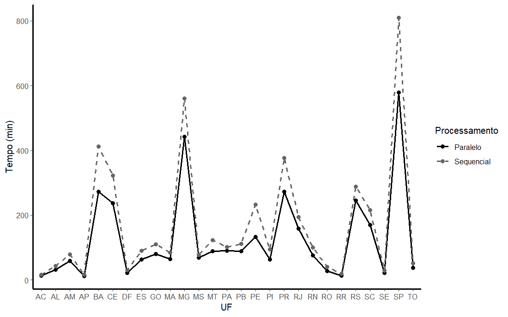
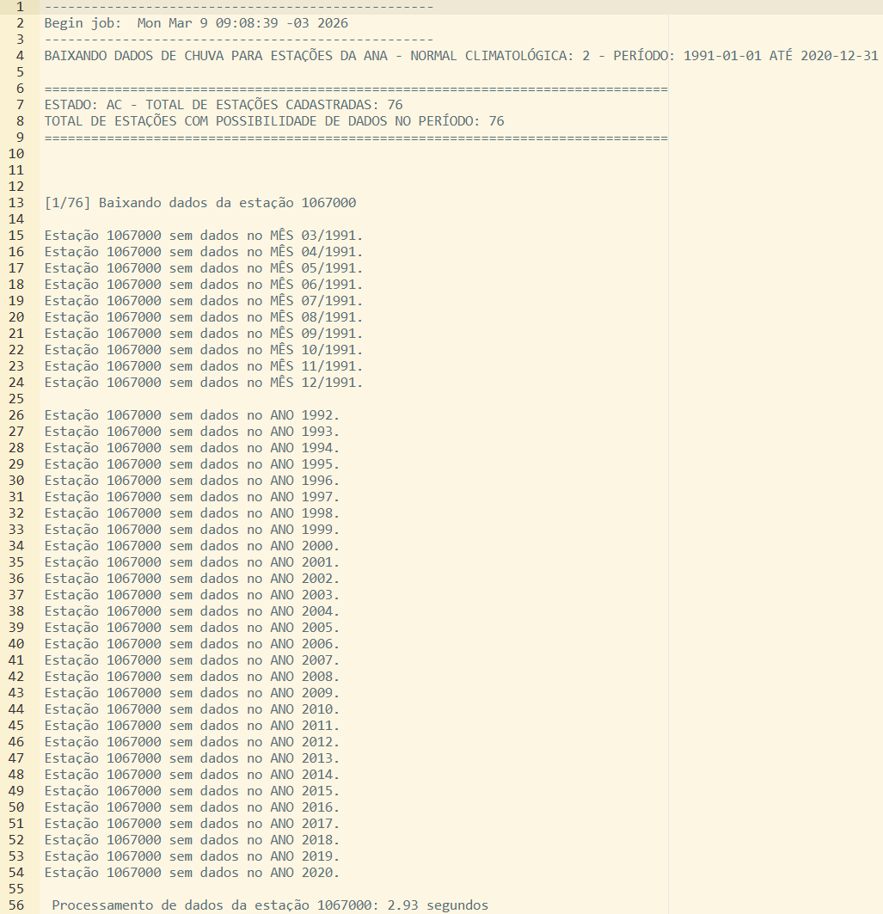
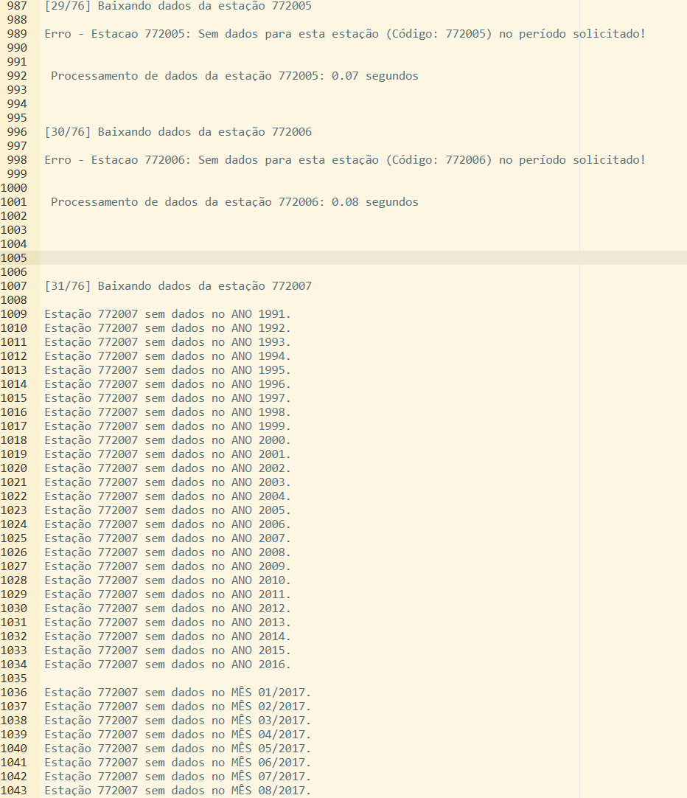
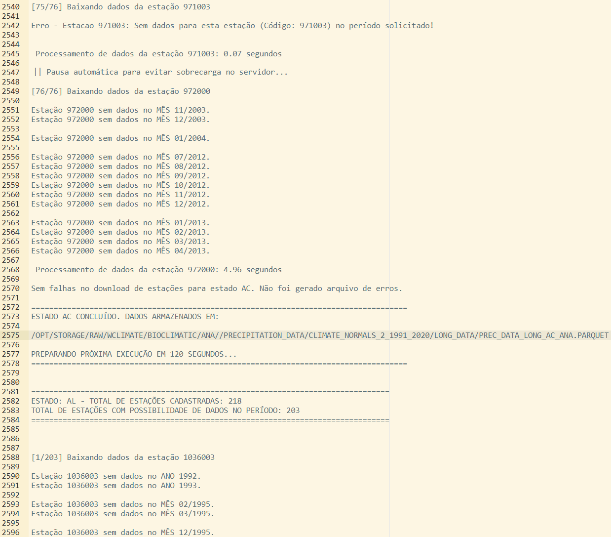
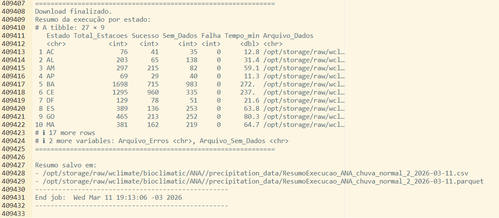

###########################################
ANA datasets
###########################################

Updated: 2025-12-30

.. contents::
   :local:
   :depth: 3

*******************
ANA gauges stations
*******************

Introduction
============

This documentation technically describes how the registration data of hydrological stations made available by the National Water and Basic Sanitation Agency (ANA) are obtained, processed, and structured. The information is accessed directly through the public API of the ServiceANA system, available in `ServiceANA <https://telemetriaws1.ana.gov.br/ServiceANA.asmx>`_ [1]_, through the `HidroInventário <https://telemetriaws1.ana.gov.br/ServiceANA.asmx?op=HidroInventario>`_ section. The developed algorithm sends HTTP GET requests, interprets the XML response, standardizes fields, corrects inconsistencies, and organizes the data into structured files, ensuring repeatability and data quality in the processing of both streamflow stations (stage/discharge) and rainfall stations (precipitation).

To download the detailed information for each station, it was first necessary to identify all stations registered in the system, since the individual code of each station is mandatory in the requests. Therefore, before collecting the specific data for the two station types considered, the script performs an initial scan of the complete inventory through automated requests, applying techniques for extraction and programmatic reading of the content returned by the API. This preliminary survey underpins the entire workflow for obtaining the registration data.

List of stations registered by the ANA
======================================

The ANA system contains records of different categories of hydrometeorological stations, including Telemetric Stations — automatic stations with real-time remote data transmission — and Conventional Stations, which rely on manual measurements performed by observers and hydrology technicians. To identify all available stations, the survey was based on the complete listing provided by the `HidroInventário <https://telemetriaws1.ana.gov.br/ServiceANA.asmx?op=HidroInventario>`_ [1]_ [2]_, which includes both conventional and telemetric stations and centralizes the registration information required for data processing.

In addition to providing the complete list of stations, the HidroInventário supplies attributes that allow the calculation of the start date of operation for each unit, an essential piece of information to determine which stations have a minimum operational history and, therefore, have their data organized and prepared for subsequent download attempts. This pre-processing step ensures that only stations with sufficient operational time are considered in the data collection workflow.

.. note::

  Only stations with a start of operation on or before 01/01/2024 were considered, ensuring that each station has at least one potential year of complete data, taking 31/12/2024 as the final reference date.

Syntax and requests
-------------------

Access to the station inventory is performed through HTTP GET requests sent to the **HidroInventario** *endpoint*. Each request accepts parameters that act as optional filters: when a parameter is left blank, the service returns all compatible stations. The script automates the construction of these URLs, handles retries in case of failures, applies pauses to avoid server overload, and can perform both nationwide queries and queries by state (UF). The main accepted parameters are:

- ``codEstDE``: Initial code of the station range (8 digits).
- ``codEstATE``: Final code of the station range (8 digits).
- ``tpEst``: Station type (``1`` = streamflow; ``2`` = rainfall).
- ``nmEst``: Station name.
- ``nmRio``: Name of the monitored river.
- ``codSubBacia``: Sub-basin code.
- ``codBacia``: Basin code.
- ``nmMunicipio``: Municipality name.
- ``nmEstado``: State name.
- ``sgResp``: Acronym of the responsible agency.
- ``sgOper``: Acronym of the operating agency.
- ``telemetrica``: Indicates active telemetry (``1`` = yes; ``0`` = no).

These filters form the basis for reconstructing the national inventory with accuracy and flexibility.

To ensure query stability, the algorithm performs requests by state (UF), using the ``nmEstado`` parameter written in full and with the exact spelling registered by ANA (for example, BAHIA) [1]_. This information is combined with the desired station type (``tpEst`` = 1 or 2), so that the service returns all stations of that type within the requested state. This strategy avoids freezes and empty responses caused by API inconsistencies and allows the complete inventory to be collected in a safe and systematic manner.

Configuration and auxiliary functions
=====================================

Before data collection, the script defines the official ANA endpoint, along with a set of auxiliary functions responsible for handling the returned content. These include routines to extract values from XML tags, convert numbers received as text, parse dates in different formats, and correct coordinates that are returned without a decimal point or that present values outside the limits of Brazilian territory. These functions form the foundation of the pipeline, allowing the data to be processed in a stable and automated manner regardless of variations in the response formats provided by the API.

Inventory registration fields
=============================

The inventory provides, for each station, a fixed set of registration fields representing operational metadata, including location (state, municipality, hydrographic basin), operator attributes, types of installed instruments, installation and removal dates, operational status, and other related information. The script maintains a single, consolidated list of all these field names, ensuring that each station is recorded using the same structure and that different queries return mutually compatible tables.

The complete list of registration fields available for both types of ANA stations is provided in a ``.csv`` file containing the data descriptions supplied by ANA.

.. note::

  The data dictionary for the variables present in the complete ANA registration listing will be made available at a later stage, after confirmation with ANA regarding the description of certain variables for which no documentation could be identified.

Candidate start and end dates of operation
==========================================

The returned data include multiple columns indicating the start and end times of operation for specific instruments (rain gauges, water level recorders, telemetric sensors, among others). Since these components may be installed at different times, the script identifies, for each station type, which columns should be taken into account. It then computes the earliest available date as the station start date and the latest available date as the end date. This procedure standardizes the station's operational period even when ANA does not provide this information in a consolidated form.

To derive the start and end dates of operation for each station type, the following variables were used:

- Streamflow stations (Type 1):

  - Start dates:

    - ``PeriodoEscalaInicio``
    - ``PeriodoRegistradorNivelInicio``
    - ``PeriodoDescLiquidaInicio``
    - ``PeriodoQualAguaInicio``
    - ``PeriodoTelemetricaInicio``

  - End dates:

    - ``PeriodoEscalaFim``
    - ``PeriodoRegistradorNivelFim``
    - ``PeriodoDescLiquidaFim``
    - ``PeriodoQualAguaFim``
    - ``PeriodoTelemetricaFim``

- Rainfall stations (Type 2):

  - Start dates:

    - ``PeriodoPluviometroInicio``
    - ``PeriodoRegistradorChuvaInicio``
    - ``PeriodoTelemetricaInicio``
    - ``PeriodoClimatologicaInicio``

  - End dates:

    - ``PeriodoPluviometroFim``
    - ``PeriodoRegistradorChuvaFim``
    - ``PeriodoTelemetricaFim``
    - ``PeriodoClimatologicaFim``

Inventory request and parsing
=============================

The collection of registration data begins by building an HTTP GET request to the ``HidroInventario`` endpoint [1]_. The function first validates the requested station type and then constructs the full URL, including all parameters supported by the service. Only the required parameters (such as ``tpEst`` and ``nmEstado``) are populated, while the remaining ones are left blank to avoid unintended filtering. The request also includes a user identifier and automatic retry mechanisms with an increasing backoff interval, ensuring stability even in the presence of temporary failures on the ANA server.

After submitting the request, the function checks the HTTP status code and, if the response is not successful, logs the error, optionally applies a pause, and returns an empty table. When the response is valid, the XML content is parsed, namespaces are removed, and the function searches for an ``<Error>`` node; if a specific error message is present, it is displayed and the processing for that state (UF) is safely interrupted. Next, the function identifies all ``<Table>`` nodes—each representing a station—and converts their fields into a tabular structure using the fixed list of attributes provided by the inventory. Finally, the received records are consolidated into a raw table and a ``tipo_estacao`` column is added to indicate the queried station type, preparing the dataset for the next cleaning and standardization steps.

Data cleaning and type casting
==============================

After extracting the station registration data, the script applies a standardization step to ensure consistency and usability of the dataset. Initially, geographic coordinates are processed: latitude and longitude values received without a decimal point are corrected and then converted to numeric values. In parallel, fields representing operational codes or indicators are cast to integers, ensuring that such information does not remain stored as text.

Next, all columns related to operational periods—those starting with ``Periodo`` and ending with ``Inicio`` or ``Fim`` are converted to date format, while administrative columns such as ``UltimaAtualizacao``, ``DataIns``, and ``DataAlt`` are converted to date-time values. Finally, textual fields undergo a cleaning process that removes trailing and leading whitespace and replaces empty strings with missing values. This structured routine ensures that all data types are coherent and that the resulting table is suitable for subsequent processes, such as date calculations, deduplication, and geographic validation.

.. _start-end-dates-gauges:
Start and end dates of operation
================================

After standardizing the date columns, the script consolidates the operational period of each station through two distinct routines. The function responsible for determining the start of operation identifies, for each station type, the set of potentially relevant columns (for example, start dates of rain gauges, water level recorders, or telemetry systems) and computes the earliest valid date among them, assigning the result to the ``DataInicioOperacao`` column. This procedure ensures that the station start date represents the earliest moment at which any associated instrument began recording data.

Complementarily, the end-of-operation calculation uses the corresponding candidate columns related to instrument decommissioning and selects the latest available date for each station, resulting in the ``DataFimOperacao`` column. This process is performed separately for each station type, respecting its specific set of fields. The outcome is two consolidated columns that describe the historical operational interval of the station, serving as a reference for temporal filtering and for analyses that depend on the duration or continuity of measurements.

This procedure is primarily intended to support the data download process by ensuring that only stations operating within the climatological normal period of interest are considered. However, cases were observed in which stations present a computable value for the ``DataFimOperacao`` variable while the ``Operando`` variable indicates a value of ``1``, characterizing an inconsistency in the registration data. Therefore, only the ``DataInicioOperacao`` column is used as support for filtering stations that began operation within each climatological normal period when performing data downloads.

Station-level deduplication
===========================

The ANA registration inventory may include multiple records for the same station, usually resulting from administrative revisions or updates performed at different points in time. To ensure that only the most up-to-date registration is retained, the script applies an ordering procedure based on administrative dates provided by ANA itself. Records are first grouped by station code and then prioritized according to the presence and recency of ``DataAlt``, ``DataIns``, and ``UltimaAtualizacao``, always favoring records in which these fields are populated and, among them, the most recent ones.

After this ordering step, the algorithm selects only the first record for each station code, ensuring that each station is represented by a single consolidated entry. This process removes duplicates, prevents inconsistencies arising from outdated registration versions, and produces a coherent final dataset suitable for subsequent analyses and for integration with other components of the inventory.

Geographic validation
=====================

Geographic validation ensures that the registered coordinates of the stations are consistent with the actual boundaries of Brazilian territory and with plausible elevation values. The implemented procedure identifies coordinates that fall outside the expected range, corrects straightforward cases, and flags situations in which the station location cannot be determined reliably. In addition, the script creates indicator variables that allow quick identification of stations with potential spatial inconsistencies. The following subsections detail the adopted criteria.

Altitude validation
-------------------

The altitude reported for some stations may present values incompatible with real-world conditions, either due to data entry errors or registration issues. The algorithm applies three main rules:

1. Slightly negative altitudes (between –10 and 0 meters) are adjusted to 0, as they may represent minor measurement inaccuracies.
2. Altitudes lower than –10 meters or higher than 3000 meters—above the highest point in Brazil—are considered invalid and replaced with ``NA``.
3. Valid altitudes remain unchanged.

These rules allow common registration errors to be corrected without discarding potentially useful information.

Latitude and longitude validation
---------------------------------

To verify whether a station is located within the geographic boundaries of Brazil, the script compares its coordinates against the known minimum and maximum ranges: approximately between –33.75° and 5.27° latitude, and between –74.00° and –28.83° longitude. If a coordinate falls outside this range, the station is flagged as having a suspicious location. This assessment generates two additional columns, ``lat_fora`` and ``lon_fora``, which take the value ``1`` when the coordinate is outside the defined limits and ``0`` otherwise. These variables support dataset auditing and enable subsequent analyses of potential spatial inconsistencies.

Main processing pipeline
========================

The function responsible for the main pipeline orchestrates and executes all preceding steps in an integrated manner for one or more station types. Based on the ``tipos`` (``"1"`` and/or ``"2"``) and ``uf`` parameters, it controls how requests are issued: when ``uf`` is ``NULL``, a single nationwide request is performed per station type; when a vector of UFs is provided, one request per state is executed, using the full state name with the exact spelling expected by ANA. In each iteration, the raw data returned by ``HidroInventario`` are accumulated and combined into a single table per station type.

The workflow then sequentially applies the post-processing routines: data cleaning and type casting, calculation of consolidated start and end dates of operation, deduplication by station code, and geographic validation. After that, an optional filter based on ``DataInicioOperacao`` (controlled by ``limite_inicio``) is applied, and summaries of the number of stations per UF are generated, both before and after the temporal filter. When the ``exportar`` parameter is enabled and ``dir_export`` is provided, the filtered data are written to ``.parquet`` files (with gzip compression) and ``.xlsx`` files, with filenames differentiated by station type. Finally, the function returns a list in which each station type contains the fully processed dataset, the filtered version, and the corresponding summaries by UF, ready for use in environmental, hydrological, or epidemiological analyses.

Script flowchart for station registration data retrieval
========================================================

The four diagrams presented below provide a structured and progressive view of how the script works. Each diagram details a specific part of the process, allowing the reader to understand, separately, the configuration steps, data requests, processing routines, and execution of the main pipeline. In the final diagram, these parts are integrated into an overview, making it easier to understand how all components work together.

The colors used in the diagrams represent groups of steps with similar roles within the pipeline: initial configuration, request and parsing operations, data validation and processing routines, and export actions. As a result, the same color appears across different diagrams whenever it refers to the same group of tasks, helping the reader quickly identify the category of each step and follow the full workflow for retrieving and processing ANA registration data.

Overview
--------

.. mermaid::

   flowchart TB
     A["Setup & Configuration"]:::configCode --> B["Schema & Registry Mapping"]:::configCode
     B --> C["Request & XML Parsing"]:::reqCode
     C --> D["Post-processing/Validation"]:::validacao
     D --> E["Outputs & Export"]:::exportacao

     %% Color palette
     classDef configCode fill:#fff3e0,stroke:#ef6c00;
     classDef reqCode fill:#e3f2fd,stroke:#1565c0;
     classDef validacao fill:#e8f5e9,stroke:#2e7d32;
     classDef exportacao fill:#ede7f6,stroke:#5e35b1;

Setup / Schema
--------------

.. mermaid::

   flowchart TB
     subgraph S1["Setup & Configuration"]
       A1["Load packages"]:::configCode
       A2["Define API constants"]:::configCode
       A3["Define helper/utility functions"]:::configCode
       A1 --> A2 --> A3
     end

     subgraph S2["Schema & Registry Mapping"]
       B1["Define file naming by station type"]:::configCode
       B2["Map registry (inventory) fields"]:::configCode
       B3["Define columns used for operation dates"]:::configCode
       B1 --> B2 --> B3
     end

     A3 --> B1

     %% Color palette
     classDef configCode fill:#fff3e0,stroke:#ef6c00;
     classDef reqCode fill:#e3f2fd,stroke:#1565c0;
     classDef validacao fill:#e8f5e9,stroke:#2e7d32;
     classDef exportacao fill:#ede7f6,stroke:#5e35b1;

Request / Parsing
-----------------

.. mermaid::

   flowchart TB
     C0["Validate station type (1 or 2)"]:::reqCode
     C1["Build GET request (params)"]:::reqCode
     C2{"HTTP 200?"}:::reqCode
     C2_no["Log HTTP error + return empty table"]:::reqCode
     C2_yes["Parse XML + drop namespaces"]:::reqCode

     C3{"XML error node?"}:::reqCode
     C3_yes["Log API error + return empty table"]:::reqCode
     C3_no["Locate <Table> nodes"]:::reqCode

     C4{"Any <Table> nodes?"}:::reqCode
     C4_no["Warn: no data for region/state + return empty table"]:::reqCode
     C4_yes["Extract stations + build raw table"]:::reqCode

     C0 --> C1 --> C2
     C2 -- "No" --> C2_no
     C2 -- "Yes" --> C2_yes --> C3
     C3 -- "Yes" --> C3_yes
     C3 -- "No" --> C3_no --> C4
     C4 -- "No" --> C4_no
     C4 -- "Yes" --> C4_yes

     %% Color palette
     classDef configCode fill:#fff3e0,stroke:#ef6c00;
     classDef reqCode fill:#e3f2fd,stroke:#1565c0;
     classDef validacao fill:#e8f5e9,stroke:#2e7d32;
     classDef exportacao fill:#ede7f6,stroke:#5e35b1;

Post-processing
---------------

.. mermaid::

   flowchart TB
     subgraph P1["Cleaning & Typing"]
       D1["Fix coordinates"]:::validacao
       D2["Convert numbers & dates"]:::validacao
       D3["Standardize text & codes"]:::validacao
       D1 --> D2 --> D3
     end

     subgraph P2["Operation Dates"]
       E1["Select period columns (by type)"]:::validacao
       E2["Compute OperationStartDate"]:::validacao
       E3["Compute OperationEndDate"]:::validacao
       E1 --> E2 --> E3
     end

     subgraph P3["Deduplication"]
       F1["Sort by administrative dates"]:::validacao
       F2["Keep most recent record per station code"]:::validacao
       F1 --> F2
     end

     subgraph P4["Geographic Validation"]
       G1["Clamp/flag altitude out of range"]:::validacao
       G2["Flag lat/lon outside Brazil"]:::validacao
       G1 --> G2
     end

     %% Pipeline connections
     D3 --> E1
     E3 --> F1
     F2 --> G1

     %% Color palette
     classDef configCode fill:#fff3e0,stroke:#ef6c00;
     classDef reqCode fill:#e3f2fd,stroke:#1565c0;
     classDef validacao fill:#e8f5e9,stroke:#2e7d32;
     classDef exportacao fill:#ede7f6,stroke:#5e35b1;

Outputs / Main Pipeline decision
---------------------------

.. mermaid::

   flowchart TB
     H0["Select station types + target states"]:::configCode
     H1{"Query mode"}:::reqCode
     H1a["Iterate: (type × state)"]:::reqCode
     H1b["Single call per type (all states)"]:::reqCode

     H2["Run post-processing & validation"]:::validacao
     H3["Filter by OperationStartDate"]:::exportacao
     H4["Generate summaries by state"]:::exportacao

     H5{"Export filtered stations?"}:::exportacao
     X1["Stations: .parquet + .xlsx"]:::exportacao
     X2["Summary by state: .xlsx"]:::exportacao
     H6["Return/store final results"]:::exportacao

     %% Pipeline logic
     H0 --> H1
     H1 -- "Iterate" --> H1a --> H2
     H1 -- "Single call" --> H1b --> H2
     H2 --> H3 --> H4 --> H5
     H5 -- "Yes" --> X1 --> X2 --> H6
     H5 -- "No" --> H6

     %% Color palette
     classDef configCode fill:#fff3e0,stroke:#ef6c00;
     classDef reqCode fill:#e3f2fd,stroke:#1565c0;
     classDef validacao fill:#e8f5e9,stroke:#2e7d32;
     classDef exportacao fill:#ede7f6,stroke:#5e35b1;

Descriptive information about listed gauges stations
====================================================

Streamflow gauges stations
--------------------------

This table presents descriptive information on the single list of streamflow gauges stations (type 1) registered in the ANA system. The following table provides values relating to the frequency of rain gauges according to the government agencies responsible.

**[Update pending]**

Rainfall gauges stations
------------------------

This table presents descriptive information on the single list of rain gauges stations (type 2) registered in the ANA system. The following table provides values relating to the frequency of rain gauges according to the government agencies responsible.

+--------------------+-----------------+
| Responsible agency | Frequency  (%)  |
+--------------------+-----------------+
| 1. ANA             | 4126 (20.6%)    |
+--------------------+-----------------+
| 2. CEMADEN         | 2533 (12.7%)    |
+--------------------+-----------------+
| 3. SPÁGUAS-SP      | 1878 (9.4%)     |
+--------------------+-----------------+
| 4. SUDENE          | 1348 (6.7%)     |
+--------------------+-----------------+
| 5. IAT-PR          | 827  (4.1%)     |
+--------------------+-----------------+
| 6. INMET           | 878  (4.1%)     |
+--------------------+-----------------+
| 7. FUNCEME-CE      | 791  (4.0%)     |
+--------------------+-----------------+
| 8. DNOCS           | 637  (3.2%)     |
+--------------------+-----------------+
| 9. EMPARN-RN       | 398  (2.0%)     |
+--------------------+-----------------+
| 10. DNOS           | 295  (1.5%)     |
+--------------------+-----------------+
| (706 others)       | 6325 (31.7%)    |
+--------------------+-----------------+

Of the 19,985 rainfall stations registered with a start of operation on or before 01/01/2024 [1]_, 20.6% are under the responsibility of ANA, while 12.7% are managed by CEMADEN (National Centre for Monitoring and Early Warning of Natural Disasters). INMET (the National Institute of Meteorology) accounts for 4.1% of stations registered in the ANA system. In addition to the 10 agencies with the highest representation (68.3%), a further 706 agencies (31.7%) also have stations registered in the system.

Spatial distribution of ANA's gauges stations
=============================================

Streamflow gauges stations
--------------------------

**[Update pending]**

Rainfall gauges stations
------------------------

**[Update pending]**

The following figure shows the spatial distribution of the rainfall gauges stations registered in the ANA system according to the agency responsible.

.. image:: _static/images/ana_img/grafico_estacoes_responsaveis.png
  :width: 600
  :alt: ANA gauges stations

Although there are stations all over Brazil, their greatest concentration is on the east coast, where the largest cities are concentrated.

***************************************
Computational Pipeline Implementation
***************************************

Overview
=========

This document describes the computational pipeline developed in ``R`` [6]_ for the automated acquisition, standardisation, and organisation of hydrometeorological historical series retrieved from the **HidroSerieHistorica** *WebService* of the National Water and Basic Sanitation Agency (ANA) [1]_. The system operates on three observational variables — precipitation, river stage (water level), and discharge — covering the climatological normals defined by the National Institute of Meteorology (INMET). The solution was designed to overcome the operational limitations of manual and pre-existing tools [4]_ [8]_, providing curated, high-granularity datasets suitable for advanced hydrological modelling and machine learning applications.

Data Scope and Temporal Coverage
==================================

The pipeline processes three types of hydrometeorological variables extracted through *XML* responses obtained via requests to the ANA *WebService* [1]_:

- **River stage / Water level** (``tipo_dados = "1"``) — fields ``Cota01`` to ``Cota31``
- **Precipitation** (``tipo_dados = "2"``) — fields ``Chuva01`` to ``Chuva31``
- **Discharge** (``tipo_dados = "3"``) — fields ``Vazao01`` to ``Vazao31``

A critical advantage of this solution is the acquisition of raw daily series, preserving the granularity required for modelling extreme hydrometeorological events, as opposed to aggregated averages, which are the data format most commonly provided by secondary sources.

The temporal coverage is based on the INMET climatological normals, structured in 30-year windows [11]_:

+--------+-----------+
| Code   | Period    |
+--------+-----------+
| 1      | 1961–1990 |
+--------+-----------+
| 2      | 1991–2020 |
+--------+-----------+
| 3      | 2021–2024 |
+--------+-----------+

Code 3 represents the period of data available from 2021 onwards, corresponding to the interval that may compose the next complete climatological normal.

**Distinction between** ``end_date`` **and** ``DataInicioOperacao``

It is important to distinguish two central temporal parameters of the pipeline:

- ``end_date`` — defines the **end date of the period of interest** for the selected climatological normal (e.g., ``1990-12-31`` for normal 1, or ``2020-12-31`` for normal 2). This parameter sets the search horizon for historical series in the ANA *WebService* and is fixed according to the temporal window of the chosen normal.

- ``DataInicioOperacao`` — is a registration attribute of each station, computed from the start dates of the installed instruments (rain gauges, water level recorders, telemetric sensors, among others). It represents the date from which the station began generating observational records.

Whereas ``end_date`` is a pipeline configuration parameter — set by the user based on the desired climatological normal — ``DataInicioOperacao`` is an intrinsic property of each station, used as a filtering criterion to determine which stations are likely to hold records within the requested period.

Station eligibility is determined by a cutoff point calculated from ``end_date``:

.. code-block:: text

   corte_final = end_date − 1 year + 1 day

Only stations whose ``DataInicioOperacao`` is on or before ``corte_final`` are included in the processing workflow. This strategy ensures that only stations potentially holding at least one full year of records within the climatological normal of interest are submitted to the download process, thereby reducing unnecessary requests to the *WebService*.

.. note::

  ``DataInicioOperacao`` is computed as described in section :ref:`start-end-dates-gauges`, based on the start dates of the instruments installed at each station. The end-of-operation date (``DataFimOperacao``) is not used as an exclusion criterion: a substantial proportion of registered stations — 57.7% of rainfall stations and 50.5% of streamflow stations — do not have this information available. Furthermore, cases were identified in which stations with a recorded ``DataFimOperacao`` still presented data in subsequent periods, which would have resulted in the unwarranted exclusion of valid records.

Technology Stack and Computational Environment
===============================================

The pipeline was developed entirely in ``R`` [6]_, prioritising libraries that ensure robustness in external communication, task parallelisation, and efficient storage of large volumes of environmental data. The technology stack was selected to favour solutions with active community support and broad adoption in environmental data analysis research.

**HTTP Communication**

- ``httr2`` [9]_ — manages interaction with the ANA *WebService*, with support for automatic *retry* and exponential *backoff*.

**XML Processing**

- ``xml2`` [10]_ — performs structured *parsing* of institutional responses, with namespace removal to simplify XPath queries.

**Data manipulation and transformation**

- ``tidyverse`` (``dplyr``, ``purrr``, ``tidyr``, ``stringr``) [10]_ — cleaning and tabular structuring of time series.
- ``lubridate`` — date and period manipulation.

**Parallelisation**

- ``future``, ``doFuture``, ``foreach`` [3]_ — asynchronous execution of monthly post-processing.

**Data persistence**

- ``arrow`` [7]_ — final storage in *Parquet* format with *gzip* compression.

The execution environment was configured with 12 *workers* operating under a ``multisession`` plan, aimed at optimising processing time by enabling each *worker* to process different months of the same station simultaneously, without compromising system stability or overloading the remote service:

.. code-block:: r

   plan(multisession, workers = 12)
   registerDoFuture()

Resilient Communication Architecture
======================================

The pipeline implements a resilient communication architecture, differentiating itself from approaches based on simple, sequential requests that are frequently susceptible to network instabilities and traffic-overload blocking [8]_. Pre-existing tools such as SisCAH, SiADH, and the ``hydrobr`` package [4]_, although useful, lacked explicit fault-tolerance mechanisms, which compromised the continuity of large-scale data collection. The set of strategies described below was designed to overcome these limitations, ensuring a higher success rate in the extraction of large data volumes.

Automatic Retry
----------------

In large-scale data collection scenarios, transient communication failures are unavoidable and may arise from network instability, momentary server overload, or incomplete service responses. To ensure processing continuity without manual intervention, the pipeline implements an automatic *retry* mechanism [9]_ that re-executes the same request up to six times before classifying the station as a technical failure:

.. code-block:: r

   req_retry(max_tries = 6, ...)

This mechanism is activated for transient failures, including network errors, momentary server overload, and unstable HTTP responses. Without automatic *retry*, any minor network fluctuation could interrupt the processing of an entire station, requiring manual restart and compromising record consistency.

Exponential Backoff
-------------------

Repeating requests in immediate succession after a failure can exacerbate the load on an unstable server, increasing the risk of further errors. To address this issue, the pipeline adopts an exponential *backoff* strategy, in which the interval between retry attempts increases progressively, respecting the server's recovery time:

.. code-block:: r

   backoff = function(attempt) min(90, 2^(attempt - 1))

The resulting sequence is:

+----------+--------------------+
| Attempt  | Wait (seconds)     |
+----------+--------------------+
| 1        | 1                  |
+----------+--------------------+
| 2        | 2                  |
+----------+--------------------+
| 3        | 4                  |
+----------+--------------------+
| 4        | 8                  |
+----------+--------------------+
| 5        | 16                 |
+----------+--------------------+
| 6        | 32 (max. 90 s)     |
+----------+--------------------+

This approach distributes retry attempts more evenly over time, reduces pressure on the remote service, and increases the probability of success under transient failure conditions — constituting a well-established fault-tolerance strategy in distributed systems [5]_.

HTTP Error Handling
------------------------

Beyond network failures, the institutional *WebService* may return HTTP status codes indicating manageable error conditions [5]_. The pipeline identifies and responds to these situations automatically, without interrupting the collection workflow. The following are considered transient failures eligible for *retry*:

- **HTTP 429** (*Too Many Requests*) — indicates that the request rate limit per unit of time has been exceeded. This condition typically arises when multiple stations are processed in rapid succession, and is mitigated by the combination of exponential *backoff* and programmatic pauses between batches.
- **HTTP 5xx** — server-side errors (500, 502, 503, 504), which indicate temporary service unavailability and typically resolve within a few minutes.

Each request is subject to a *timeout* of 180 seconds to prevent stalled calls from blocking pipeline execution indefinitely.

Load Control
-----------------

In addition to the reactive *retry* and *backoff* mechanisms, the pipeline adopts a proactive load control strategy by inserting programmatic pauses at different levels of the process. This approach reduces the risk of saturating the institutional *WebService* and contributes to stable, large-scale extraction in compliance with the response capacity of the national repository:

- **6 seconds** between consecutive station requests.
- **60 seconds** after every batch of 30 processed stations.
- **120 seconds** at each transition between Brazilian states (UF).

Series Selection and Validation Criteria
==========================================

When responding to a request, the ANA *WebService* [1]_ may return multiple concurrent monthly series for the same station and period. This overlap results from the coexistence of raw and consistent records in the national repository. To address this redundancy, the algorithm implements a deterministic selection model based on a strict hierarchy of technical criteria, ensuring that only the most representative series for each month is included in the final dataset.

Primary Criterion (DataHora)
----------------------------

Series are prioritised according to the reference date (``DataHora``), following the structural logic of the institutional database, in which complete monthly series tend to be indexed by the first day of the month:

1. Series whose ``DataHora`` falls on the **first day of the month**.
2. If absent, series with ``DataHora`` on the **last day of the month**.
3. If absent, any series with ``DataHora`` **within the month**.

Tiebreaking Criteria
----------------------

In the event of a tie between candidates satisfying the same primary criterion, the algorithm applies a tiebreaking hierarchy oriented by data quality and recency:

1. **Highest** ``NivelConsistencia`` (Level 2 — Consistent, over Level 1 — Raw).
2. **Shortest** distance in days to the first day of the month.
3. Presence of ``DataIns`` (records with an insertion metadata field take priority).
4. Most **recent** ``DataIns`` — ensures that corrections and revisions subsequently made by ANA are incorporated into the final dataset.

.. note::

   Approximately 76% of the selected monthly series, considering precipitation data for the period 1991–2020, corresponded to Level 2 (consistent) data, indicating a high proportion of records that had already undergone institutional quality control.

Daily Parsing and Calendar Reconstruction
------------------------------------------

Following the selection of the best monthly series, the pipeline performs daily *parsing*, individually extracting the observation fields (e.g., ``Chuva01`` to ``Chuva31``) along with their corresponding ``Status`` fields. ``Status`` is a quality indicator associated with each daily record and follows the ANA institutional encoding [1]_:

+--------+-----------------+-------------------------------------------------------+
| Code   | Classification  | Description                                           |
+--------+-----------------+-------------------------------------------------------+
| 0      | Blank           | No quality information available.                     |
+--------+-----------------+-------------------------------------------------------+
| 1      | Observed        | Direct observation, considered most reliable.         |
+--------+-----------------+-------------------------------------------------------+
| 2      | Estimated       | Value inferred by interpolation or indirect method.   |
+--------+-----------------+-------------------------------------------------------+
| 3      | Doubtful        | Record suspected of inconsistency.                    |
+--------+-----------------+-------------------------------------------------------+
| 4      | Accumulated     | Value represents accumulation over multiple periods.  |
+--------+-----------------+-------------------------------------------------------+

Months with no data are filled with ``NA``, preserving the temporal continuity of the *dataset*. Intra-monthly anomalies are handled by retaining the daily record with the lowest valid ``Status > 0``, given that, in ANA's encoding, lower positive numeric values indicate observations of higher reliability and superior levels of technical validation. This logic mitigates spurious duplications and enhances the robustness of the consolidated series.

Parallelised Processing and Temporal Consolidation
====================================================

The parallelisation strategy adopted differs from conventional approaches: rather than parallelising HTTP requests across stations — which would significantly increase the risk of HTTP 429 blocking and could saturate the remote service — the pipeline parallelises the **monthly post-processing within the response of a single station** [3]_. This architecture delivers performance gains without compromising the stability of requests to the ANA *WebService*.

.. code-block:: r

   foreach(mes = meses, .combine = bind_rows) %dofuture% {
     # monthly series processing
   }

Solution for xml2 External Pointers
--------------------------------------

``xml2`` [10]_ objects are not serialisable for parallel processes because they are based on external C pointers. Attempting to send an XML object directly to *workers* would generate the error ``external pointer is not valid``, interrupting processing. The adopted solution circumvents this limitation in two steps:

1. Extract each ``<SerieHistorica>`` node as an XML *string* before sending it to the *workers*.
2. Reconstruct the XML internally within each *worker* using an artificial *wrapper*:

.. code-block:: xml

   <root xmlns:diffgr="..." xmlns:msdata="...">
     <!-- SerieHistorica fragment -->
   </root>

This *wrapper* provides a valid root node and reinstalls the *namespaces* required by the fragment's attributes, preventing *parsing* warnings and ensuring the integrity of the reconstructed XML structure.

Final Consolidation
--------------------

Following parallel processing, data are sorted chronologically to reconstruct complete daily calendars. Periods with no data are explicitly represented by ``NA`` values, which guarantees:

- Temporal continuity of the series, eliminating distortions in rolling-window analyses or extreme-value statistics.
- Consistent cardinality for merging with other temporal datasets.
- Suitability for models such as SWAT (*Soil and Water Assessment Tool*), which require continuous records to adequately simulate hydrological cycle processes.

Metadata Generation and Reproducibility
==========================================

The pipeline incorporates a robust system for generating metadata and analytical *logs*, ensuring quality control, traceability, and transparency at each stage of the process. Unlike manual queries, in which error histories are rarely documented, the algorithm records temporal transitions, years with missing records, and blocks of absent data, formatting messages to avoid redundancies and facilitate subsequent human review.

Station Classification
--------------------------

Each processed station is automatically classified into one of three distinct semantic categories, enabling the differentiation of genuine data absences from technical extraction failures:

- **With valid data** — complete return with at least one real record (non-``NA``).
- **No data in the period** — successful request, but no records found within the requested interval. Archived separately to avoid contaminating the final *dataset*.
- **Technical failure** — persistent connection errors after the *retry* cycle, or XML *parsing* failures, isolated for subsequent technical audit.

Output Structure
------------------

For each state (UF), separate files are generated by result category, organised in standardised directories:

.. code-block:: text

   <variable>_data/
   └── climate_normals_<N>_<start_year>_<end_year>/
       ├── long_data/          ← time series with valid data (one file per state)
       ├── nodata_gauges/      ← stations with no data in the period
       └── problem_gauges/     ← stations with technical failure

All files are stored in *Parquet* format with *gzip* compression [7]_, ensuring high read performance and volumetric efficiency.

Execution Summary
------------------

At the end of each state (UF), the system generates a consolidated summary table in both CSV and *Parquet* formats containing: total eligible stations, successful extractions, data absences, technical failures, and total elapsed processing time. This audit mechanism enables faithful reproduction of the collection process across different temporal windows, in alignment with best practices for research based on secondary data from institutional APIs.

Pipeline Diagram
==================

The diagram below represents the complete pipeline workflow, from the loading of the station inventory to the persistence of data by state.

.. mermaid::

   flowchart TB
     A["Load station inventory"]:::configCode
     B["Select climatological normal"]:::configCode

     C["Loop by state (UF)"]:::reqCode
     D["Filter eligible stations (DataInicioOperacao ≤ corte_final)"]:::reqCode
     E["Loop by station"]:::reqCode
     F["HTTP request to ANA WebService (httr2 + retry + backoff)"]:::reqCode
     G{"Valid response?"}:::reqCode
     G_no["Log to error_list → continue"]:::reqCode

     G_yes["Parse XML (xml2 + ns_strip)"]:::validacao
     H{"<Error> node?"}:::validacao
     H_yes["Return NA calendar"]:::validacao
     H_no["Extract <SerieHistorica> nodes"]:::validacao
     I["Serialize series as strings (external pointers solution)"]:::validacao
     J["Parallel processing by month (foreach %dofuture%)"]:::validacao
     K["Select best monthly series (deterministic criteria)"]:::validacao
     L["Extract daily values (Chuva01–Chuva31 / Status / Consistence)"]:::validacao
     M["Consolidate station (complete daily calendar + NA)"]:::validacao

     N{"Classify result"}:::exportacao
     N1["values_list (valid data)"]:::exportacao
     N2["nodata_list (no data)"]:::exportacao
     N3["error_list (technical failure)"]:::exportacao
     O["Write Parquet (gzip) files by state (UF)"]:::exportacao
     P["Generate final summary CSV + Parquet"]:::exportacao

     A --> B --> C --> D --> E --> F --> G
     G -- "No" --> G_no --> E
     G -- "Yes" --> G_yes --> H
     H -- "Yes" --> H_yes --> M
     H -- "No" --> H_no --> I --> J --> K --> L --> M
     M --> N
     N --> N1 & N2 & N3
     N1 & N2 & N3 --> O --> P

     classDef configCode fill:#fff3e0,stroke:#ef6c00;
     classDef reqCode fill:#e3f2fd,stroke:#1565c0;
     classDef validacao fill:#e8f5e9,stroke:#2e7d32;
     classDef exportacao fill:#ede7f6,stroke:#5e35b1;

***********************
Results and Discussion
***********************

Overview of Obtained Data
==========================

The pipeline processed a total of **36,063 registered stations**, comprising 19,985 rainfall stations and 16,078 streamflow stations distributed across the 27 Brazilian states [1]_. The dataset was restricted to stations with ``DataInicioOperacao`` on or before 01/01/2024, so as to ensure at least one complete year of data relative to the final reference date adopted (31/12/2024). This date was defined by the update latency observed in the ANA database, given that more recent records were still being entered into the system at the time of extraction, particularly for the year 2025.

Table 1 presents the station inventory qualification and eligibility by climatological normal.

.. list-table:: Table 1 — Station inventory qualification and eligibility by climatological normal
   :header-rows: 2
   :widths: 15 18 18 18 18 18

   * - Type
     - Registered stations
     - 1961–1990
     - 1991–2020
     - 2021–2024
     - Missing end date (%)
   * -
     -
     - Eligible (%)
     - Eligible (%)
     - Eligible (%)
     -
   * - Precipitation
     - 19,985
     - 11,627 (58.18)
     - 19,582 (97.98)
     - 19,985 (100)
     - 57.7
   * - Stage
     - 16,078
     - 6,534 (40.64)
     - 15,149 (94.22)
     - 16,078 (100)
     - 50.5
   * - Discharge
     - 16,078
     - 6,534 (40.64)
     - 13,249 (82.4)
     - 16,078 (100)
     - 50.5

*Source: Original research results.*

.. note::

   The high proportion of stations lacking ``DataFimOperacao`` (50%–58%) supports the approach adopted: eligibility was determined exclusively by ``DataInicioOperacao``, without relying on decommissioning metadata that are frequently absent from the institutional registry. Additionally, cases were identified in which stations with a recorded ``DataFimOperacao`` still presented data in subsequent periods, which would have led to the unwarranted exclusion of valid records.

Computational Performance and Parallelisation Efficiency
==========================================================

Computational performance was evaluated using precipitation data from the 1991–2020 climatological normal, covering 19,582 eligible stations. This subset was selected as it represents a robust operational scenario with a high data volume and broad spatial coverage, providing adequate conditions for pipeline performance assessment. Results compare sequential and parallel (12 *workers*) processing [3]_, with identical parameters and datasets applied in both scenarios to ensure comparability.

The figure below illustrates the comparison of execution times across the two scenarios.

   **Figure 1** — Execution times for precipitation data retrieval (1991–2020). Parallel processing achieved a reduction of approximately 26% in total execution time relative to the sequential approach.

+------------------------+---------------------------+------------------+
| Scenario               | Total time                | Gain             |
+------------------------+---------------------------+------------------+
| Sequential             | ~4,629 min (77.1 h)       | —                |
+------------------------+---------------------------+------------------+
| Parallel (12 workers)  | ~3,430 min (57.2 h)       | ~1.35× (~26%)    |
+------------------------+---------------------------+------------------+

*Source: Original research results.*

The performance gain was proportionally greater in states with denser monitoring networks, as the scaling of monthly tasks could be exploited more intensively. It should be noted that these values reflect a practical application subject to network latencies and the response limitations of the remote service, and therefore represent realistic operational benchmarks.

Quality and Consistency of the Extracted Dataset
==================================================

The quality of the extracted data constitutes one of the main evaluation criteria of the pipeline. Table 2 details the execution summary for precipitation data from the 1991–2020 climatological normal, presenting the number of eligible stations per state and the classification of results into three categories: stations with retrieved data, stations with no data available in the analysed period, and stations with extraction failures.

.. list-table:: Table 2 — Pipeline execution summary and precipitation data availability by state (1991–2020)
   :header-rows: 1
   :widths: 8 18 14 14 10 18

   * - State
     - Eligible stations
     - With data
     - No data
     - Failure
     - Availability (%)
   * - AC
     - 76
     - 41
     - 35
     - 0
     - 53.95
   * - AL
     - 203
     - 65
     - 138
     - 0
     - 32.02
   * - AM
     - 297
     - 215
     - 82
     - 0
     - 72.39
   * - AP
     - 69
     - 29
     - 40
     - 0
     - 42.03
   * - BA
     - 1,698
     - 715
     - 983
     - 0
     - 42.11
   * - CE
     - 1,295
     - 960
     - 335
     - 0
     - 74.13
   * - DF
     - 129
     - 78
     - 51
     - 0
     - 60.47
   * - ES
     - 389
     - 136
     - 253
     - 0
     - 34.96
   * - GO
     - 465
     - 213
     - 252
     - 0
     - 45.81
   * - MA
     - 381
     - 162
     - 219
     - 0
     - 42.52
   * - MG
     - 2,345
     - 783
     - 1,534
     - 28
     - 33.39
   * - MS
     - 311
     - 169
     - 141
     - 1
     - 54.34
   * - MT
     - 505
     - 257
     - 248
     - 0
     - 50.89
   * - PA
     - 395
     - 198
     - 196
     - 1
     - 50.13
   * - PB
     - 457
     - 310
     - 147
     - 0
     - 67.83
   * - PE
     - 893
     - 202
     - 691
     - 0
     - 22.62
   * - PI
     - 385
     - 261
     - 124
     - 0
     - 67.79
   * - PR
     - 1,496
     - 1,037
     - 459
     - 0
     - 69.32
   * - RJ
     - 970
     - 409
     - 561
     - 0
     - 42.16
   * - RN
     - 512
     - 111
     - 401
     - 0
     - 21.68
   * - RO
     - 168
     - 93
     - 75
     - 0
     - 55.36
   * - RR
     - 64
     - 53
     - 11
     - 0
     - 82.81
   * - RS
     - 1,307
     - 339
     - 951
     - 17
     - 25.94
   * - SC
     - 985
     - 223
     - 759
     - 3
     - 22.64
   * - SE
     - 145
     - 45
     - 100
     - 0
     - 31.03
   * - SP
     - 3,430
     - 1,365
     - 2,063
     - 2
     - 39.80
   * - TO
     - 212
     - 100
     - 112
     - 0
     - 47.17

*Source: Original research results.*

Approximately **43.76%** of eligible stations yielded valid time series. The majority of stations classified as having no data were associated with the genuine absence of records in the requested period — not with technical extraction failures, which accounted for only **0.27%** of the total — demonstrating the algorithm's high robustness in accessing the remote service. The spatial variability in data availability — ranging from 21.68% (RN) to 82.81% (RR) — reflects differences in regional monitoring network density and the historical availability of records across different parts of the country.

Storage Efficiency and Data Organisation
==========================================

Storage efficiency is a critical factor in applications involving large volumes of environmental time series. The adoption of *Parquet* format with *gzip* compression [7]_ yielded substantial volumetric efficiency gains. Table 3 compares the total data volume for precipitation data (1991–2020) in CSV and Parquet formats, considering the same processed dataset.

.. list-table:: Table 3 — Storage volume comparison: CSV vs. Parquet (gzip) (1991–2020)
   :header-rows: 1
   :widths: 30 30 30

   * - Format
     - Total size (MB)
     - Reduction (%)
   * - CSV
     - 6,866
     - —
   * - Parquet (gzip)
     - 181
     - 97.36%

*Source: Original research results.*

The columnar structure of *Parquet* enables more effective compression, preserves variable typing, and allows selective reading of specific columns. Unlike the CSV format, which stores data as plain text without explicit typing, *Parquet* reduces redundancies and enables greater optimisation in data access operations. In the context of environmental *Big Data* applications, these characteristics make *Parquet* a more appropriate format for large-scale time series processing.

Pipeline Robustness and Error Handling
========================================

Pipeline robustness was evaluated through the analysis of *logs* generated during execution. The system differentiates three distinct operational situations semantically, enabling granular monitoring of system behaviour across success, data absence, and communication failure scenarios.

**Normal execution with data**

The system records temporal transitions, years with missing records, and blocks of absent data, formatting messages to avoid redundancies and facilitate subsequent human review. The figure below illustrates the typical start of an execution.

   **Figure 2** — Example of an analytical *log* detailing the execution structure and pipeline traceability (1991–2020). The system sequentially records each processed station, with explicit indication of missing data by month and year.

**Station with no data in the period**

When the *WebService* returns a valid response but with no records in the requested interval, the pipeline maintains processing continuity and systematically records the absence. The absence of records is not interpreted as a technical error, allowing the station to be properly categorised in the control files and avoiding unnecessary interruptions to the collection workflow.

   **Figure 3** — Example of an execution *log* for a station with no available data in the period (1991–2020). The absence of records is not classified as a technical error, allowing the station to be properly categorised.

**Communication failures and load control**

Connection errors activate the *retry* and *backoff* mechanisms, while automatic pauses between states prevent server overload at the ANA. When the retry cycle is exhausted without success, the station is recorded in ``error_list`` and processing advances to the next station, without interrupting the global workflow.

   **Figure 4** — *Log* records demonstrating communication failures and activation of load control mechanisms (1991–2020).

**Consolidated execution report**

At the end of each state, the system generates a structured report with operational performance statistics, including the total number of processed stations, the classification of results by category, and the total elapsed execution time. This output demonstrates the pipeline's capacity not only to execute the collection process, but also to generate structured information for monitoring, auditing, and reproducibility of results.

   **Figure 5** — Consolidated operational performance report and classification of results by state (UF) (1991–2020).

Download Process Limitations
==============================

Although the pipeline demonstrates high operational robustness, certain limitations inherent to the extraction process should be considered when interpreting results and planning future applications.

**Access via unauthenticated public WebService**

The algorithm operates directly on the public **HidroSerieHistorica** *WebService* [1]_, without the need for prior authentication. While this broadens the immediate applicability of the tool, unauthenticated access imposes restrictions on the volume of data returned per request. ANA also provides an official API interface (HidroWeb), access to which requires a formal request and institutional evaluation. Integration with this official API could increase the volume of data obtained per request, while maintaining the validation and structuring protocols already established by the pipeline.

**Incomplete station registration metadata**

A relevant limitation identified in the station inventory concerns the frequent absence of complete registration information, particularly ``DataFimOperacao`` [1]_. Between 50% and 58% of registered stations lack this information, depending on the data type. Additionally, inconsistencies were identified in which stations with a recorded end-of-operation date still presented observational records in subsequent periods. No data dictionary for the station registration metadata was found in ANA's publicly available documentation [8]_. This scenario reinforces the need for the approach adopted — based on empirical validation of data availability via the *WebService* — rather than exclusive reliance on static registration metadata.

**Institutional repository update latency**

The most recent data provided by ANA exhibit variable update latency, particularly for the current year. Recent records may still be undergoing insertion and validation in the national repository at the time of extraction, which can result in incomplete series for periods closest to the extraction date. For this reason, the pipeline adopts 31/12/2024 as the final reference date, even for collections performed in 2025.

**WebService operational instability**

The ANA institutional *WebService* may experience occasional instabilities, particularly when subjected to multiple consecutive requests. Tools such as SisCAH, SiADH, and the ``hydrobr`` package [4]_, although designed for similar purposes, lack explicit fault-tolerance mechanisms and large-scale metadata management, making them vulnerable to these fluctuations. The pipeline mitigates this issue through automatic *retry*, exponential *backoff* [9]_, and load control mechanisms [5]_. However, prolonged instabilities or persistent traffic-overload blocking may still result in residual technical failures, which are recorded in ``problem_gauges`` for subsequent auditing.

**Regional heterogeneity of the monitoring network**

Data availability varies considerably across Brazilian states, reflecting historical differences in the density and continuity of hydrometeorological monitoring networks across the national territory [8]_. Regions with lower station coverage, such as parts of the Northeast and the Amazon basin, tend to exhibit more fragmented series and a higher proportion of stations with no data in the analysed period. This heterogeneity is an intrinsic characteristic of the national observational repository [1]_ and cannot be circumvented by the pipeline, which operates exclusively on the data made available by ANA.

**Parallelisation restricted to monthly post-processing**

The parallelisation strategy adopted — restricted to monthly post-processing within a single station — represents a deliberate trade-off between performance gain and the stability of requests to the *WebService*. Parallelising HTTP requests across multiple simultaneous stations would significantly increase the risk of HTTP 429 blocking [5]_ and could compromise the integrity of the collection. As a result, the performance gain achieved (~26% reduction in total time) reflects this trade-off and is proportionally smaller than what would be expected under full parallelisation.

Alternative data manual download
=================================

Daily precipitation data for stations registered with ANA can also be obtained through a manual download process via the open-access `HidroWeb <https://www.snirh.gov.br/hidroweb/serieshistoricas>`_ system [2]_. From HidroWeb it is possible to search for stations by code, name, type, operator, state, or associated river basin. The download is performed individually per station, generating a compressed file (.zip) containing the precipitation data in the requested format (.txt, .csv, or .mdb).

The HidroWeb system also offers the possibility of API access [2]_. However, users wishing to access HidroWeb data and information in an automated manner must submit a formal request by e-mail, which will be subject to institutional evaluation.

- Download precipitation data: https://www.snirh.gov.br/hidroweb/serieshistoricas
- Request API access: https://www.snirh.gov.br/hidroweb/acesso-api

.. rubric:: References

.. [1] Agência Nacional de Águas e Saneamento Básico [ANA]. 2025. *HidroSerieHistorica* — ServiceANA: web service for historical hydrometeorological series. ANA, Brasília, DF, Brazil. Available at: <https://telemetriaws1.ana.gov.br/ServiceANA.asmx>.

.. [2] Agência Nacional de Águas e Saneamento Básico [ANA]. 2025. *WebServices*: Consulta às Estações Telemétricas. ANA, Brasília, DF, Brazil. Available at: <https://telemetriaws1.ana.gov.br/EstacoesTelemetricas.aspx>.

.. [3] Bengtsson, H. 2021. A unifying framework for parallel and distributed processing in R using futures. *The R Journal* 13(2): 208–227.

.. [4] Calegario, A.T. et al. 2024. Download e pré-processamento de dados hidroclimáticos do Hidroweb/ANA com o pacote hydrobr. *XVII Simpósio de Recursos Hídricos do Nordeste*, João Pessoa, PB, Brazil.

.. [5] Fielding, R.T. 2000. *Architectural styles and the design of network-based software architectures*. Doctoral dissertation – University of California, Irvine, USA.

.. [6] R Core Team. 2025. *R: A language and environment for statistical computing*. R Foundation for Statistical Computing, Vienna, Austria. Available at: <https://www.R-project.org/>.

.. [7] Richardson, N. et al. 2025. *arrow*: Integration to 'Apache' 'Arrow'. R package version 21.0.0.1. Available at: <https://CRAN.R-project.org/package=arrow>.

.. [8] Silva, G.M. 2025. A obtenção de dados de precipitação nos principais repositórios nacionais brasileiros. *Revista Contribuciones a las Ciencias Sociales* 18(2): 1–16.

.. [9] Wickham, H. 2025. *httr2*: Perform HTTP requests and process the responses. R package version 1.2.1. Available at: <https://CRAN.R-project.org/package=httr2>.

.. [10] Wickham, H. et al. 2019. Welcome to the tidyverse. *Journal of Open Source Software* 4(43): 1686.

.. [11] Xavier, A.C.; King, C.W.; Scanlon, B.R. 2016. Daily gridded meteorological variables in Brazil (1980–2013). *International Journal of Climatology* 36(6): 2644–2659.

.. rubric:: Contributors

+-------------------+----------------------------------------------------------------------+
| Marcos Eustorgio Filho | Center for Data and Knowledge Integration for Health (CIDACS),  |
|                        | Instituto Gonçalo Moniz, Fundação Oswaldo Cruz, Salvador, Brazil|
+-------------------+----------------------------------------------------------------------+
| Danielson Neves        | Center for Data and Knowledge Integration for Health (CIDACS),  |
|                        | Instituto Gonçalo Moniz, Fundação Oswaldo Cruz, Salvador, Brazil|
+-------------------+----------------------------------------------------------------------+

