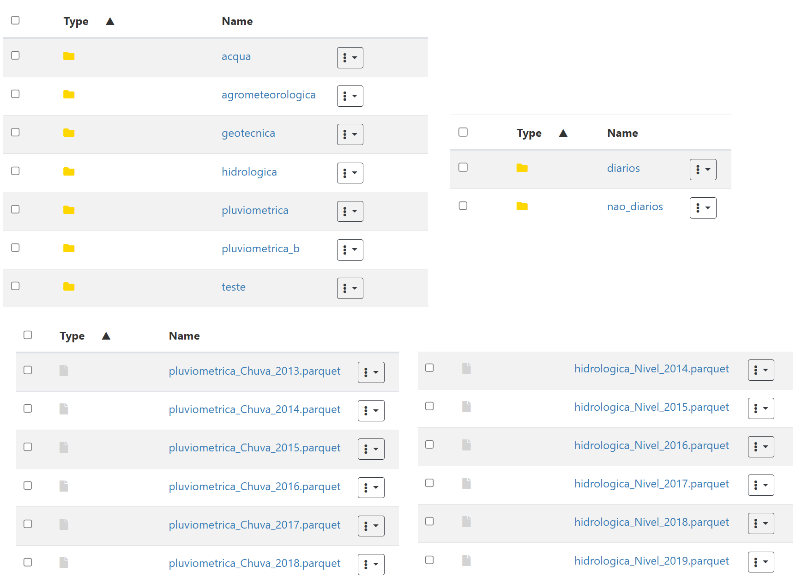

================
CEMADEN datasets
================
Updated: 2025-02-15

Introduction: What is CEMADEN?
------------------------------

.. _cemaden-observational-data: http://www2.cemaden.gov.br/

.. _cemaden-ped-platform: https://ped.cemaden.gov.br/

CEMADEN (National Center for Monitoring and Alerts of Natural Disasters) is an institution linked to the Ministry of Science, Technology and Innovation (MCTI) that works in the monitoring of risks and the issuance of alerts of natural disasters in Brazil. Its main mission is to preserve lives and reduce socioeconomic damage by anticipating extreme events, such as landslides, floods, flash floods, and droughts.

CEMADEN collects environmental data from various sources and sensors spread throughout the national territory, through the Observational Network, which comprises meteorological, hydrological, rainfall, geotechnical stations, among others.

How to access the data: PED Platform
------------------------------------

The observational data collected by CEMADEN are available to the public through the `Data Delivery Platform (PED) <https://ped.cemaden.gov.br/>`_ [2]_. In it, anyone can make data requests, respecting some rules:

*	Limit of requests:

  *	External users: up to 12 requests per minute.
  *	Institutional partners: up to 180 requests per minute.

*	Scheduled requests (histories) are available for download for 30 days .
*	Accounts that have been inactive for more than one year are automatically removed.

.. note::
   It is mandatory to cite the source of the data when using them: DATA FROM THE CEMADEN/MCTIC OBSERVATIONAL NETWORK.

Data structure
--------------

The data made available in the `PED <https://ped.cemaden.gov.br/>`_ [2]_ follow a clear organization, both in format and classification:

*	Each station file can contain data in two categories:

  *	**Daily** (e.g., accumulated rainfall per day);
  *	**Non-daily** (e.g. hourly, real-time data).

*	The stations also have different **types**:

  *	"C" → Acqua
  *	"U" → Agrometeorological
  *	"G" → Geotechnical
  *	"H" → Hydrological
  *	"A" → Rainfall
  *	"B" → Rainfall B
  *	"T" → Test

Types of sensors
^^^^^^^^^^^^^^^^

Each type of station monitored by CEMADEN presents data according to some sensors. These sensors monitor different environmental variables.

See the :ref:`Sensor types table <tabela-sensores>` for the codes associated with the environmental variables monitored by each station type.

.. _tabela-sensores:

.. table:: Sensor types for CEMADEN stations
   :widths: auto
   :align: center

   ======== ===============================================
   Code     Description
   ======== ===============================================
   10       Rain
   20       Level
   60       Air temperature
   90       Relative humidity
   180      Wind speed
   190      Wind direction
   210      Solar radiation
   240      Precipitation Intensity
   260      Minimum Level
   270      Maximum Level
   280      Balance Radiation
   290      Soil Temperature Level 1
   300      Soil Temperature Level 2
   310      Soil Temperature Level 3
   320      Soil Temperature Level 4
   330      Soil Moisture Level 1
   340      Soil Moisture Level 2
   350      Soil Moisture Level 3
   360      Soil Moisture Level 4
   370      Maximum daily air temperature
   390      Maximum daily relative humidity
   400      Minimum daily relative humidity
   410      Maximum daily wind speed
   420      Wind direction at maximum daily speed
   430      Daily prevailing wind direction
   440      Soil Temperature Level 1 Maximum Daily
   450      Soil Temperature Level 1 Daily Minimum
   460      Soil Temperature Level 2 Maximum Daily
   470      Soil Temperature Level 2 Daily Minimum
   480      Soil Temperature Level 3 Maximum Daily
   490      Soil Temperature Level 3 Daily Minimum
   500      Soil Temperature Level 4 Maximum Daily
   510      Soil Temperature Level 4 Daily Minimum
   520      Soil Moisture Level 1 Maximum Daily
   530      Soil Moisture Level 1 Daily Minimum
   540      Soil Moisture Level 2 Maximum Daily
   550      Soil Moisture Level 2 Minimum Daily
   560      Soil Moisture Level 3 Maximum Daily
   570      Soil Moisture Level 3 Minimum Daily
   580      Soil Moisture Level 4 Maximum Daily
   590      Soil Moisture Level 4 Minimum Daily
   600      Daily Accumulated Precipitation
   610      Soil Moisture Level 5
   620      Soil Moisture Level 6
   630      Soil Moisture Level 5 Maximum Daily
   640      Soil Moisture Level 5 Minimum Daily
   650      Soil Moisture Level 6 Maximum Daily
   660      Soil Moisture Level 6 Minimum Daily
   ======== ===============================================

.. note::
   Important: Not all station types have data for the Daily or Non-Daily categories and neither do the same sensors. Each type can provide different data, depending on its specific sensors.

Processing Script
-----------------

The data made available via PED are later processed into a structure that combines information from several stations, however, maintaining the separation by Type of station, Category (Daily / Non-daily), Type of sensor and Year, covering the period from 2013 to 2024. The period covered includes information from 2013 onwards, as this is the year of registration of the first station registered in the CEMADEN system.

After processing, the data files are segmented according to the structure defined above, being organized into directories according to the subdivisions by type, category, sensor and year.

For rainfall stations, hourly data are accumulated to form daily series, which allows the analysis of the volume of accumulated daily rainfall, calculation of indicators such as SPI and SPEI and comparison with other precipitation data, such as those made available by the National Water Agency (ANA).

List of stations
----------------

CEMADEN provides the list of stations registered via PED through a Web request service, returning data that can be structured in table format. These data correspond to the records of stations registered in the CEMADEN system, and which have descriptive and geolocation information.

When carrying out the analysis, all stations registered until 12/31/2023 were considered, so that, in 2024, there may be stations with at least 1 year of registered data. Among the 3873 stations registered by the deadline.

The list of stations made available by CEMADEN has a structure similar to the one shown below:

+------+---------------+------------+---------+-------------------------+------------+------------+------------+--------------------+------------+-----------------------+-----+
|      | cidade        | codestacao | codibge | data_instalacao         | id_estacao | latitude   | longitude  | nome               | rede_sigla | tipoestacao_descricao | uf  |
+------+---------------+------------+---------+-------------------------+------------+------------+------------+--------------------+------------+-----------------------+-----+
| 0    | BRASÍLIA      | 530010805A | 5300108 | 2015-02-09 19:09:43.717 | 7878       | -15.876800 | -47.962700 | Nucleo Bandeirante | CEMADEN    | Pluviométrica         | DF  |
+------+---------------+------------+---------+-------------------------+------------+------------+------------+--------------------+------------+-----------------------+-----+
| 1    | BRASÍLIA      | 530010804A | 5300108 | 2015-02-09 17:23:13.357 | 7877       | -15.623700 | -47.846900 | Sobradinho         | CEMADEN    | Pluviométrica         | DF  |
+------+---------------+------------+---------+-------------------------+------------+------------+------------+--------------------+------------+-----------------------+-----+
| 2    | BRASÍLIA      | 530010803A | 5300108 | 2015-02-09 17:15:08.558 | 7876       | -15.781966 | -47.998073 | Cidade Estrutural  | CEMADEN    | Pluviométrica         | DF  |
+------+---------------+------------+---------+-------------------------+------------+------------+------------+--------------------+------------+-----------------------+-----+
| 3    | BRASÍLIA      | 530010802A | 5300108 | 2015-02-09 17:05:58.246 | 7875       | -15.818400 | -48.153300 | Ceilandia          | CEMADEN    | Pluviométrica         | DF  |
+------+---------------+------------+---------+-------------------------+------------+------------+------------+--------------------+------------+-----------------------+-----+
| 4    | BRASÍLIA      | 530010801A | 5300108 | 2014-12-29 17:39:06.077 | 7635       | -15.827000 | -48.023000 | Águas Claras       | CEMADEN    | Pluviométrica         | DF  |
+------+---------------+------------+---------+-------------------------+------------+------------+------------+--------------------+------------+-----------------------+-----+
| ...  | ...           | ...        | ...     | ...                     | ...        | ...        | ...        | ...                | ...        | ...                   | ... |
+------+---------------+------------+---------+-------------------------+------------+------------+------------+--------------------+------------+-----------------------+-----+
| 3868 | JORDÃO        | 120032801A | 1200328 | 2018-08-14 21:36:09.819 | 9674       | -9.190133  | -71.950808 | Centro             | CEMADEN    | Pluviométrica         | AC  |
+------+---------------+------------+---------+-------------------------+------------+------------+------------+--------------------+------------+-----------------------+-----+
| 3869 | BRASILÉIA     | 120010401A | 1200104 | 2018-08-14 20:39:49.214 | 9673       | -11.012469 | -68.740939 | Centro             | CEMADEN    | Pluviométrica         | AC  |
+------+---------------+------------+---------+-------------------------+------------+------------+------------+--------------------+------------+-----------------------+-----+
| 3870 | PORTO VELHO   | 110020502A | 1100205 | 2013-12-13 14:23:10.344 | 3014       | -8.762160  | -63.907421 | Porto Velho        | CEMADEN    | Pluviométrica         | RO  |
+------+---------------+------------+---------+-------------------------+------------+------------+------------+--------------------+------------+-----------------------+-----+
| 3871 | PORTO VELHO   | 110020501A | 1100205 | 2013-12-12 18:04:09.767 | 3151       | -8.742165  | -63.904242 | AC São Sebastião   | CEMADEN    | Pluviométrica         | RO  |
+------+---------------+------------+---------+-------------------------+------------+------------+------------+--------------------+------------+-----------------------+-----+
| 3872 | PIMENTA BUENO | 110018901A | 1100189 | 2018-08-18 15:58:30.208 | 9740       | -11.683234 | -61.182871 | Apidia             | CEMADEN    | Pluviométrica         | RO  |
+------+---------------+------------+---------+-------------------------+------------+------------+------------+--------------------+------------+-----------------------+-----+

The dictionary with all the variables available on CEMADEN's station registration form is available in :ref:`Station registration variables <station-variable-table>` below:

.. _station-variable-table:

.. table:: Variables available in CEMADEN station records
   :widths: auto
   :align: center

   ========================  ===============================================================  ==========
   Variable                  Description                                                      Type
   ========================  ===============================================================  ==========
   altitude                  Station altitude in meters                                       float64
   cidade                    Name of the city where the station is located                    object
   codestacao                Station code according to CEMADEN                                object
   codibge                   IBGE code of the municipality (7 digits)                         int64
   cota_alerta               River level alert quota (confirm)                                float64
   cota_atencao              River level attention quota (confirm)                            float64
   cota_transbordamento      River overflow quota (confirm)                                   float64
   data_instalacao           Station installation date and time                               object
   dh_cadastro               Date and time of registration of the station                     object
   dh_inicio_inativo         Date and time of the start of the inactive status                object
   dh_ultima_remessa         Date and time of last data shipment                              object
   id_estacao                Unique station identifier                                        int64
   id_rede                   Observational network identifier                                 int64
   id_tipoestacao            Station type identifier                                          int64
   latitude                  Latitude of the station in decimal degrees                       float64
   longitude                 Longitude of the station in decimal degrees                      float64
   nome                      Station name                                                     object
   offset                    Distance (in meters) between the river bottom and the sensor     float64
   rede_sigla                Station network acronym (e.g. CEMADEN)                           object
   tipoestacao_descricao     Description of the type of station (e.g. Rainfall)               object
   uf                        Federative Unit (UF) of the station                              object
   ========================  ===============================================================  ==========

The data regarding the list of stations were obtained through the python code developed to make requests to the CEMADEN system via PED. However, to make these requests, it is necessary to register with the PED, with login and password, so that a temporary access token is generated, necessary to make data requests.

.. note::
   
   You can download the complete list of registered stations here: `CEMADEN registered stations <_static/lista_estacoes_cemaden.csv>`_

Geographical coverage by type of stations
-----------------------------------------

The stations of the CEMADEN Observational Network are distributed in the Brazilian national territory, with their highest concentration near the coast (east). Each station is categorized according to different types.

The :ref:`Table of station frequencies by type <station-type-frequency>` presents the frequencies and percentages of CEMADEN stations registered as of 12/31/2025, according to their respective types.

.. _station-type-frequency:

.. table:: Number and percentage of CEMADEN stations by type
   :widths: auto
   :align: center

   =======================  ==========  ============
   Station Type             Frequency   Percentage (%)
   =======================  ==========  ============
   Rainfall                 3100        80.04
   Acqua                    447         11.54
   Hydrologic               148         3.82
   Geotechnical             96          2.48
   Agrometeorological       82          2.12
   =======================  ==========  ============

The table with :ref:`station frequencies by region <station-by-region>` presents the frequencies and percentages of CEMADEN stations registered as of 12/31/2025, according to the Brazilian regions.

.. _station-by-region:

.. table:: Number and percentage of CEMADEN stations by Brazilian region
   :widths: auto
   :align: center

   ==========  ==========  =============
   Region      Frequency   Percentage (%)
   ==========  ==========  =============
   Southeast   1694        43.7
   Northeast   1252        32.3
   South       647         16.7
   North       175         4.5
   Midwest     105         2.7
   ==========  ==========  =============

Among the Brazilian regions, the distribution of CEMADEN stations is as follows: Southeast Region with 1,694 stations (43.7%), Northeast Region with 1,252 (32.3%), South Region with 647 (16.7%), North Region with 175 (4.5%), and Midwest Region with 105 (2.7%).

The table with :ref:`station frequencies by state <station-by-state>` presents the frequencies and percentages of CEMADEN stations registered as of 12/31/2025, according to the Brazilian states.

.. _station-by-state:

.. table:: Number and percentage of CEMADEN stations by Brazilian state
   :widths: auto
   :align: center

   ========================  ======================  ===============
   Federative Unit           Number of Stations      Percentage (%)
   ========================  ======================  ===============
   São Paulo                 707                     18.25
   Minas Gerais              436                     11.26
   Rio de Janeiro            371                     9.58
   Pernambuco                371                     9.58
   Santa Catarina            364                     9.40
   Bahia                     303                     7.82
   Ceará                     188                     4.85
   Espírito Santo            180                     4.65
   Rio Grande do Sul         170                     4.39
   Paraná                    113                     2.92
   Maranhão                  99                      2.56
   Piauí                     76                      1.96
   Amazon                    72                      1.86
   Paraíba                   72                      1.86
   Rio Grande do Norte       67                      1.73
   Pará                      65                      1.68
   Alagoas                   59                      1.52
   Goiás                     52                      1.34
   Mato Grosso               25                      0.65
   Mato Grosso do Sul        23                      0.59
   Tocantins                 17                      0.44
   Sergipe                   17                      0.44
   Acre                      6                       0.15
   Amapá                     6                       0.15
   Roraima                   6                       0.15
   Federal District          5                       0.13
   Rondônia                  3                       0.08
   ========================  ======================  ===============

The ten states with the highest number of registered stations are: São Paulo with 707 stations (18.25%), Minas Gerais with 436 (11.26%), Rio de Janeiro and Pernambuco both with 371 (9.58%), Santa Catarina with 364 (9.40%), Bahia with 303 (7.82%), Ceará with 188 (4.85%), Espírito Santo with 180 (4.65%), Rio Grande do Sul with 170 (4.39%), and Paraná with 113 (2.92%).

The table with :ref:`station-type-by-region` presents the frequencies and percentages (per row) of CEMADEN station types distributed across the Brazilian regions.

.. _station-type-by-region:

.. table:: Frequencies and percentages of CEMADEN station types by Brazilian region
   :widths: auto
   :align: center

   ===================  ============  ======================  ==============  ==============  ===================
   Region                Acqua         Agrometeorological     Geotechnical    Hydrologic      Rainfall
   ===================  ============  ======================  ==============  ==============  ===================
   Southeast Region      31 (1.83%)    4 (0.24%)               57 (3.36%)      80 (4.72%)      1522 (89.85%)
   Northeast Region      416 (33.23%)  78 (6.23%)              28 (2.24%)      29 (2.32%)      701 (55.99%)
   South Region          0 (0.0%)      0 (0.0%)                11 (1.7%)       30 (4.64%)      606 (93.66%)
   North Region          0 (0.0%)      0 (0.0%)                0 (0.0%)        5 (2.86%)       170 (97.14%)
   Midwest Region        0 (0.0%)      0 (0.0%)                0 (0.0%)        4 (3.81%)       101 (96.19%)
   ===================  ============  ======================  ==============  ==============  ===================

The table shows the frequency and percentage (by row) of each CEMADEN station type across the five Brazilian regions.

Figure :ref:`station-distribution-map` shows the spatial distribution of the 3.873 stations registered in CEMADEN as of 12/31/2023.

.. _station-distribution-map:

.. figure:: images/station_distribution_cemaden.png
   :alt: Spatial distribution of CEMADEN stations
   :align: center
   :width: 700

   Spatial distribution of the 3.873 CEMADEN stations as of 12/31/2023.

The stations of the type 'Pluviometric B' are categorized as pluviometric in the cadastral list, while the 'Test' stations do not have a record in the registration form although they have data made available via PED.

Data availability
-----------------

The data were downloaded through a request registered with the PED. After evaluation and approval steps, a link is generated containing files in csv format, one per station. However, the number of files made available differs from the number of stations registered in the CEADEN system and therefore an evaluation was carried out seeking to understand how many registered stations have data made available via PED and how many registered stations have data available for download, considering the date of 03/25/2025, when the station data were downloaded after approval of the request.

In all, of the 4027 stations with available data, 3867 have registration in the list of stations, while 160 stations have data, but are not included in the registration list.

Conclusion
----------

CEMADEN is an essential pillar in the policy of prevention of natural disasters in Brazil. Through its robust data collection infrastructure and the PED platform, researchers, public managers, and society have access to valuable information to mitigate risks and plan response actions.

.. rubric:: References

.. [1] Centro Nacional de Monitoramento e Alertas de Desastres Naturais – CEMADEN. Observational Network Data of CEMADEN/MCTIC [Internet]. Brazil: CEMADEN; [cited 2025 May 19]. Available from: http://www2.cemaden.gov.br/

.. [2] Centro Nacional de Monitoramento e Alertas de Desastres Naturais – CEMADEN. Data Delivery Platform - PED [Internet]. Brazil: CEMADEN; [cited 2025 May 19]. Available from: https://ped.cemaden.gov.br/

**Contributors**

+-------------------+----------------------------------------------------------------------+
| Marcos Eustorgio Filho | Center for Data and Knowledge Integration for Health (CIDACS),  |
|                        | Instituto Gonçalo Moniz, Fundação Oswaldo Cruz, Salvador, Brazil|
+-------------------+----------------------------------------------------------------------+
| Danielson Neves        | Center for Data and Knowledge Integration for Health (CIDACS),  |
|                        | Instituto Gonçalo Moniz, Fundação Oswaldo Cruz, Salvador, Brazil|
+-------------------+----------------------------------------------------------------------+

