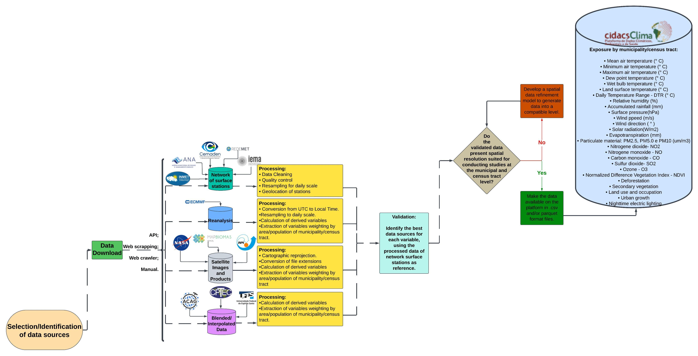

Cidacs Climate and Environment Platform - Documentation
=======================================================

This documentation provides a description of all the databases used in "Cidacs-Clima: Cidacs Climate and Environment Platform". This platform was created to investigate the effects of climate and the environment on the health of the population, as well as to analyze how health, environmental or social policies mitigate the impacts of climate adversities [1]_. Funded by the Wellcome Trust, the project aims to integrate a variety of climate data, such as satellite information, data from weather stations, reanalysis data and information on extreme weather events [2]_. The aim is to contribute to the debate on the effects of climate storms on health, especially among low-income populations, who are more vulnerable to climate exposure.

Coordinated by Cidacs, the initiative brings together partners such as the National Institute for Space Research (INPE), the National Center for Natural Disaster Monitoring and Alerts (CEMADEN), the European Space Agency (ESA), Fiocruz's Institute for Scientific and Technological Communication and Information (ICICT), and the Rene Rachou Institute (Fiocruz Minas Gerais). It also has the collaboration of the Fiocruz Center for International Relations in Health, the University of São Paulo (USP), The London School of Economics and Political Science (LSE), The London School of Hygiene & Tropical Medicine (LSHTM), the University of Lancaster, the Barcelona Institute for Global Health (ISGlobal), and the Federal University of Bahia (UFBA) [1]_.

With a vast longitudinal database, including the Cohort of 100 Million Brazilians, the platform has the potential to lead innovative studies on the relationship between climate and health, contributing significantly to the advancement of knowledge and decision-making in public policy.

In the next sections, we explain each database associated with this project, including the repository they are stored in, access permissions and an overview of the data files and their formats. In addition, we provide detailed descriptions of the methods used to collect the data, the computational processing, and the potential for data reuse.

Links, references, codes, program, or data processing workflow is provided to facilitate understanding or use the data.

.. note::

   This documentation is under active development.

Contents
--------

.. toctree::
   ana_data
   cams_data
   cemaden_data
   mapbiomas_data
   modis_lst_data
   ndvi_data
   srtm_data

.. rubric:: References

.. [1] CIDACS. Plataforma Climática e Ambiental. August 2024. https://cidacs.bahia.fiocruz.br/plataforma/plataforma-de-dados-climaticos/

.. [2] Wellcome Trust. Combining climate and health data: challenges and opportunities for longitudinal population studies. Retrieved 08 14, 2024, from https://cms.wellcome.org/sites/default/files/2022-01/climate-lps-landscaping-report.pdf
